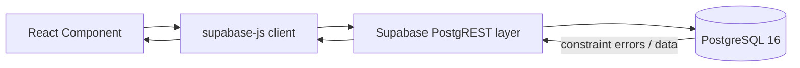

# api.md — Hospital Management System

## 1. API / Data Access Overview

The Hospital Management System does not document a separate custom REST API server (no Express, FastAPI, or similar backend). Data access is provided directly through **Supabase** and the **`@supabase/supabase-js`** client library, which the React 19 + TypeScript frontend calls to read and write PostgreSQL tables. Supabase auto-generates a RESTful (PostgREST) interface over the schema described in `database.md`, and `supabase-js` is a typed wrapper around that interface.

This means the application's "API boundary" is: **frontend component → `supabase-js` query builder → Supabase's PostgREST layer → PostgreSQL 16**, with PostgreSQL's own constraints (primary keys, foreign keys, CHECKs, the appointment UNIQUE constraint) as the final, non-bypassable validation layer — not a hand-written API server with its own validation logic.



Every function shown in this document (`getPatients()`, `createPatient()`, etc.) is a **documentation example of a recommended wrapper function**, not a function that already exists in a shipped codebase. They illustrate how a developer would structure `supabase-js` calls for each table.

---

## 2. Supabase Client

A single shared client instance is initialized once and imported wherever data access is needed:

```typescript
// src/lib/supabaseClient.ts
import { createClient } from '@supabase/supabase-js';

const supabaseUrl = import.meta.env.VITE_SUPABASE_URL;
const supabaseAnonKey = import.meta.env.VITE_SUPABASE_ANON_KEY;

export const supabase = createClient(supabaseUrl, supabaseAnonKey);
```

---

## 3. Environment Configuration

Vite exposes environment variables prefixed with `VITE_` to client code. A typical `.env` file:

```
VITE_SUPABASE_URL=https://<project-ref>.supabase.co
VITE_SUPABASE_ANON_KEY=<anon-public-key>
```

- `VITE_SUPABASE_URL` — the project's Supabase API endpoint.
- `VITE_SUPABASE_ANON_KEY` — the public anon key, safe for client-side use **only** when Row Level Security (RLS) policies properly restrict what that key can do (see Section 15).

`.env` files should be excluded from version control; only `.env.example` (with placeholder values) should be committed.

---

## 4. Database Tables Accessible by the Application

Per `database.md`, the application reads and writes the following tables through `supabase-js`:

`departments`, `doctors`, `patients`, `room_beds`, `admissions`, `appointments`, `medications`, `prescription_items`, `invoices`.

---

## 5. CRUD Operations — Pattern

Every table follows the same general `supabase-js` shape:

```typescript
// Read
const { data, error } = await supabase.from('table_name').select('*');

// Create
const { data, error } = await supabase.from('table_name').insert({ ...fields }).select().single();

// Update
const { data, error } = await supabase.from('table_name').update({ ...fields }).eq('id_column', id).select().single();

// Delete
const { error } = await supabase.from('table_name').delete().eq('id_column', id);
```

`error` is non-null whenever PostgreSQL rejects the operation — including constraint violations documented in `database.md` (FK violations, CHECK violations, UNIQUE violations). The application must always check `error` before trusting `data`.

---

## 6. Table-by-Table Examples

### 6.1 `patients`

**`getPatients()`**
- **Purpose:** Retrieve the patient roster (e.g., for a search/select list).
- **Input:** none, or an optional search string.
- **Table:** `patients`.
- **Expected output:** array of patient rows.
- **Possible errors:** network/auth errors; RLS policy denial.
- **Relevant constraints:** none triggered by a read.

```typescript
export async function getPatients() {
  const { data, error } = await supabase
    .from('patients')
    .select('*')
    .order('last_name', { ascending: true });

  if (error) throw error;
  return data;
}
```

**`createPatient()`**
- **Purpose:** Register a new patient.
- **Input:** `first_name`, `last_name`, `dob`, `gender`, `blood_group`, `phone`, `email`.
- **Table:** `patients`.
- **Expected output:** the newly created patient row, including generated `patient_id`.
- **Possible errors:** `23505` (unique_violation) if `email` already exists.
- **Relevant constraints:** `UNIQUE` on `email`.

```typescript
interface NewPatient {
  first_name: string;
  last_name: string;
  dob: string;
  gender: string;
  blood_group: string;
  phone: string;
  email: string;
}

export async function createPatient(patient: NewPatient) {
  const { data, error } = await supabase
    .from('patients')
    .insert(patient)
    .select()
    .single();

  if (error) {
    if (error.code === '23505') {
      throw new Error('A patient with this email is already registered.');
    }
    throw error;
  }
  return data;
}
```

---

### 6.2 `doctors`

**`getDoctors()`**
- **Purpose:** Retrieve doctors, optionally with their department joined in.
- **Input:** optional `dept_id` filter.
- **Table:** `doctors` joined to `departments`.
- **Expected output:** array of doctors, each with a nested `departments` object.
- **Possible errors:** RLS denial; invalid filter value.
- **Relevant constraints:** none triggered by a read.

```typescript
export async function getDoctors(deptId?: number) {
  let query = supabase
    .from('doctors')
    .select('*, departments(dept_name, floor)');

  if (deptId) {
    query = query.eq('dept_id', deptId);
  }

  const { data, error } = await query;
  if (error) throw error;
  return data;
}
```

**`createDoctor()`**
- **Purpose:** Register a new doctor.
- **Input:** `first_name`, `last_name`, `specialization`, `fee`, `phone`, `dept_id`.
- **Table:** `doctors`.
- **Expected output:** newly created doctor row.
- **Possible errors:** `23503` (foreign_key_violation) if `dept_id` doesn't exist; `23514` (check_violation) if `fee <= 0`.
- **Relevant constraints:** `fk_doctor_dept`, `chk_fee_positive`.

```typescript
export async function createDoctor(doctor: {
  first_name: string;
  last_name: string;
  specialization: string;
  fee: number;
  phone: string;
  dept_id: number;
}) {
  const { data, error } = await supabase
    .from('doctors')
    .insert(doctor)
    .select()
    .single();

  if (error) {
    if (error.code === '23514') throw new Error('Fee must be greater than zero.');
    if (error.code === '23503') throw new Error('Selected department does not exist.');
    throw error;
  }
  return data;
}
```

---

### 6.3 `departments`

```typescript
export async function getDepartments() {
  const { data, error } = await supabase
    .from('departments')
    .select('*, head_doctor:doctors(first_name, last_name)');

  if (error) throw error;
  return data;
}
```
- **Purpose:** List departments with their head doctor's name resolved via the `head_doctor_id` relationship.
- **Table:** `departments` joined to `doctors`.
- **Relevant constraints:** `fk_head_doctor` (`ON DELETE SET NULL`) means a department can legitimately come back with `head_doctor: null`.

---

### 6.4 `appointments`

**`createAppointment()`**
- **Purpose:** Book an appointment.
- **Input:** `patient_id`, `doctor_id`, `appt_date`, `time_slot`.
- **Table:** `appointments`.
- **Expected output:** the created appointment row with `status: 'scheduled'`.
- **Possible errors:** `23505` (unique_violation) on `(doctor_id, appt_date, time_slot)` — the doctor already has an appointment at that slot; `23503` if `patient_id`/`doctor_id` don't exist.
- **Relevant constraints:** `uq_doctor_slot`, `chk_appt_status`.

```typescript
export async function createAppointment(appt: {
  patient_id: number;
  doctor_id: number;
  appt_date: string; // 'YYYY-MM-DD'
  time_slot: string; // 'HH:MM'
}) {
  const { data, error } = await supabase
    .from('appointments')
    .insert({ ...appt, status: 'scheduled' })
    .select()
    .single();

  if (error) {
    if (error.code === '23505') {
      throw new Error('This doctor already has an appointment at that date and time.');
    }
    throw error;
  }
  return data;
}
```

This function is the client-side counterpart to the database-enforced conflict prevention described in `database.md` Section 6.1 and `orchestration.md` Section 3.5: the UNIQUE constraint, not application logic, is what ultimately decides whether the booking succeeds.

**Reading a doctor's schedule for a date (filtering + ordering):**

```typescript
export async function getDoctorSchedule(doctorId: number, date: string) {
  const { data, error } = await supabase
    .from('appointments')
    .select('*, patients(first_name, last_name)')
    .eq('doctor_id', doctorId)
    .eq('appt_date', date)
    .order('time_slot', { ascending: true });

  if (error) throw error;
  return data;
}
```

---

### 6.5 `room_beds`

**`getAvailableBeds()`**
- **Purpose:** List beds currently available for a new admission.
- **Input:** optional `ward_type` filter.
- **Table:** `room_beds`.
- **Expected output:** array of beds with `status = 'available'`.
- **Possible errors:** RLS denial.
- **Relevant constraints:** relies on `chk_bed_status` having kept `status` values well-formed.

```typescript
export async function getAvailableBeds(wardType?: string) {
  let query = supabase
    .from('room_beds')
    .select('*')
    .eq('status', 'available');

  if (wardType) {
    query = query.eq('ward_type', wardType);
  }

  const { data, error } = await query;
  if (error) throw error;
  return data;
}
```

---

### 6.6 `admissions`

**`createAdmission()`**
- **Purpose:** Admit a patient — insert the admission and mark the bed occupied.
- **Input:** `patient_id`, `bed_id`, `doctor_id`, `admission_date`, optional `notes`.
- **Table:** `admissions`, plus an `UPDATE` on `room_beds`.
- **Expected output:** the created admission row.
- **Possible errors:** `23503` if `patient_id`/`bed_id`/`doctor_id` don't exist; `23514` if the bed-status update violates `chk_bed_status`.
- **Relevant constraints:** `fk_admission_patient`, `fk_admission_bed`, `fk_admission_doctor`, `chk_bed_status`.
- **Transactional note:** `supabase-js` issues each `.from(...)` call as its own request; PostgREST does not expose multi-statement client transactions directly. Where an operation must be atomic across tables — as this one is (see `database.md` Section 8 and `orchestration.md` Section 3.6) — the recommended approach is a Postgres function (RPC) called via `supabase.rpc(...)`, so both statements commit or roll back together inside the database itself, rather than as two independent client calls.

```typescript
// Recommended: a Postgres function exposed via RPC keeps this atomic.
export async function createAdmission(admission: {
  patient_id: number;
  bed_id: number;
  doctor_id: number;
  admission_date: string;
  notes?: string;
}) {
  const { data, error } = await supabase.rpc('admit_patient', admission);
  if (error) throw error;
  return data;
}
```

```typescript
// Non-atomic two-call alternative (documented here for completeness;
// carries the race-condition risk described in database.md Section 8.1).
export async function createAdmissionTwoStep(admission: {
  patient_id: number;
  bed_id: number;
  doctor_id: number;
  admission_date: string;
  notes?: string;
}) {
  const { data: newAdmission, error: admissionError } = await supabase
    .from('admissions')
    .insert(admission)
    .select()
    .single();
  if (admissionError) throw admissionError;

  const { error: bedError } = await supabase
    .from('room_beds')
    .update({ status: 'occupied' })
    .eq('bed_id', admission.bed_id);
  if (bedError) throw bedError;

  return newAdmission;
}
```

---

### 6.7 `medications`

**`getMedications()`**
- **Purpose:** List medications, optionally flagging low stock.
- **Input:** none.
- **Table:** `medications`.
- **Expected output:** array of medication rows.
- **Possible errors:** RLS denial.
- **Relevant constraints:** none triggered by a read; `chk_stock_nonnegative` guarantees `stock_qty` values returned are never negative.

```typescript
export async function getMedications() {
  const { data, error } = await supabase
    .from('medications')
    .select('*')
    .order('med_name', { ascending: true });

  if (error) throw error;
  return data;
}

export async function getLowStockMedications() {
  const { data, error } = await supabase
    .from('medications')
    .select('*')
    .lte('stock_qty', supabase.rpc ? undefined : 0); // see note below
  if (error) throw error;
  return data;
}
```

> **Note:** PostgREST filter syntax compares a column against a literal or another column via `.filter()`, not a second column directly in `.lte()`. A correct column-to-column comparison (`stock_qty <= min_threshold`) requires either a Postgres view/function exposed via RPC, or `.filter('stock_qty', 'lte', 'min_threshold')` using PostgREST's raw filter operators. The simplest documented-safe approach is a small Postgres function:

```typescript
export async function getLowStockMedications() {
  const { data, error } = await supabase.rpc('low_stock_medications');
  if (error) throw error;
  return data;
}
```

---

### 6.8 `prescription_items`

**`createPrescriptionItem()`**
- **Purpose:** Add a medication to an admission's chart and reflect the stock deduction.
- **Input:** `admission_id`, `med_id`, `quantity`, `dosage_instructions`.
- **Table:** `prescription_items`, plus an `UPDATE` on `medications`.
- **Expected output:** the created prescription item row.
- **Possible errors:** `23514` if `quantity <= 0`; `23503` if `admission_id`/`med_id` don't exist; `23514` on `medications` if the deduction would push `stock_qty` below zero.
- **Relevant constraints:** `fk_item_admission`, `fk_item_medication`, `chk_quantity_positive`, `chk_stock_nonnegative`.
- **Transactional note:** as with admission creation, the insert and the stock decrement should be atomic — an RPC function is the recommended pattern.

```typescript
export async function createPrescriptionItem(item: {
  admission_id: number;
  med_id: number;
  quantity: number;
  dosage_instructions?: string;
}) {
  const { data, error } = await supabase.rpc('add_prescription_item', item);

  if (error) {
    if (error.code === '23514') {
      throw new Error('Insufficient stock, or invalid quantity, for this medication.');
    }
    throw error;
  }
  return data;
}
```

---

### 6.9 `invoices`

**`getInvoice()`**
- **Purpose:** Retrieve an admission's invoice, with its charge breakdown.
- **Input:** `admission_id`.
- **Table:** `invoices`.
- **Expected output:** a single invoice row, or `null` if not yet generated.
- **Possible errors:** RLS denial.
- **Relevant constraints:** none triggered by a read.

```typescript
export async function getInvoice(admissionId: number) {
  const { data, error } = await supabase
    .from('invoices')
    .select('*')
    .eq('admission_id', admissionId)
    .maybeSingle();

  if (error) throw error;
  return data;
}
```

**Updating invoice status:**

```typescript
export async function markInvoicePaid(invoiceId: number) {
  const { data, error } = await supabase
    .from('invoices')
    .update({ status: 'paid' })
    .eq('invoice_id', invoiceId)
    .select()
    .single();

  if (error) {
    if (error.code === '23514') throw new Error('Invalid invoice status.');
    throw error;
  }
  return data;
}
```
- **Relevant constraints:** `chk_invoice_status`, `fk_invoice_admission`.

---

## 7. Query Patterns

`supabase-js`'s query builder maps directly onto SQL clauses:

| SQL concept | supabase-js method |
|---|---|
| `SELECT columns` | `.select('col1, col2')` |
| `WHERE col = val` | `.eq('col', val)` |
| `WHERE col <= val` | `.lte('col', val)` |
| `WHERE col IN (...)` | `.in('col', [...])` |
| `ORDER BY` | `.order('col', { ascending: bool })` |
| `LIMIT` | `.limit(n)` |
| Single row expected | `.single()` (errors if 0 or >1 rows) / `.maybeSingle()` (returns `null` if 0 rows) |

## 8. Insert Operations

Inserts use `.insert({...}).select().single()` to both write the row and immediately get the generated primary key and defaulted columns back in one round trip, avoiding a second read.

## 9. Update Operations

Updates use `.update({...}).eq('pk_column', value)`. Omitting the `.eq(...)` filter would update every row in the table — this is a documented risk of the query-builder pattern, not a database-level protection, so every update in this codebase must include an explicit filter.

## 10. Delete Operations

```typescript
export async function deleteAppointment(appointmentId: number) {
  const { error } = await supabase
    .from('appointments')
    .delete()
    .eq('appointment_id', appointmentId);
  if (error) throw error;
}
```
Deletes on tables with `ON DELETE CASCADE` children (e.g., deleting an `admissions` row) will cascade to `prescription_items` and `invoices`, per `database.md` Section 2.

## 11. Filtering

Filters (`.eq`, `.lte`, `.gte`, `.in`, `.like`) compose by chaining, and PostgREST applies them as a combined `WHERE` clause with implicit `AND`.

## 12. Ordering

`.order('col', { ascending })` can be chained multiple times for multi-column sorts, e.g., ordering appointments by `appt_date` then `time_slot`.

## 13. Joins / Relationships

`supabase-js` exposes foreign-key relationships as nested `select()` syntax, e.g. `.select('*, departments(dept_name)')` on `doctors`, which PostgREST resolves via the `fk_doctor_dept` foreign key documented in `database.md`. This works in both directions (a doctor can select its department, and a department can select its doctors as a nested array) because PostgREST inspects the schema's foreign keys automatically.

## 14. Error Handling

Every `supabase-js` call returns `{ data, error }` rather than throwing. The application-wide convention shown throughout this document is: check `error` first, inspect its PostgreSQL error `code` (e.g., `23505` unique_violation, `23503` foreign_key_violation, `23514` check_violation) to produce a user-facing message, and otherwise rethrow for a generic error boundary to catch. This keeps constraint violations documented in `database.md` mapped to specific, actionable UI messages rather than a generic "something went wrong."

## 15. Authentication Considerations

Supabase Auth (if enabled) issues a session JWT that `supabase-js` attaches to every request automatically once a user is signed in. The report does not document a specific authentication scheme for the HMS beyond the use of Supabase, so this section describes the standard Supabase mechanism available to the application rather than an HMS-specific one.

## 16. Authorization Considerations

Because there is no custom API server enforcing role checks, **Row Level Security (RLS) policies on each table are the actual authorization boundary** — not the frontend's UI (which can be bypassed by calling the Supabase REST endpoint directly with a valid session). Any role distinction the HMS needs (e.g., only billing staff can update `invoices.status`; only ward staff can update `room_beds.status`) must be expressed as RLS policies in Postgres, since the anon/authenticated key used by `supabase-js` has no inherent notion of hospital roles on its own.

## 17. Database Constraints as the Final Protection

Every example above shows application code attempting to validate input before sending it (checking a fee is positive, a quantity is positive, an email looks well-formed). **These frontend and wrapper-function checks are conveniences, not guarantees.** Because Supabase exposes the database directly through PostgREST, any client capable of making an authenticated HTTP request — not just this React application — can attempt to insert or update rows. The constraints documented in `database.md` (`fk_*` foreign keys, `chk_*` CHECK constraints, `UNIQUE` constraints including `uq_doctor_slot`) are what actually make invalid states impossible, regardless of which client, query, or code path produced the request. Application-side validation exists to give users fast, friendly feedback; the database constraints exist to make bad data physically un-insertable.

## 18. Security Considerations

- The anon key is public by design; **RLS policies, not key secrecy, are what must protect the data.**
- Service-role keys (which bypass RLS) must never be used in client-side code — they belong only in trusted server contexts, which this architecture, as documented, does not include.
- Multi-statement operations that must be atomic (admission creation, prescription creation with stock deduction, discharge/billing) are best implemented as Postgres functions called via `supabase.rpc(...)` rather than as sequential client-side calls, both for atomicity and so the authorization/validation logic lives in one trusted place rather than being duplicated across every client that might call the API.
