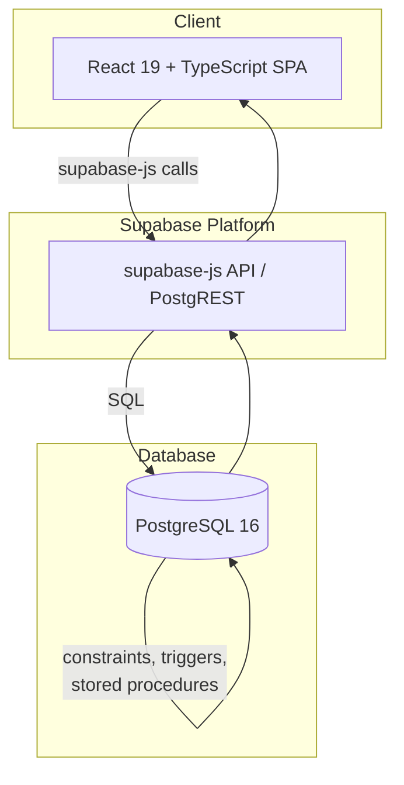
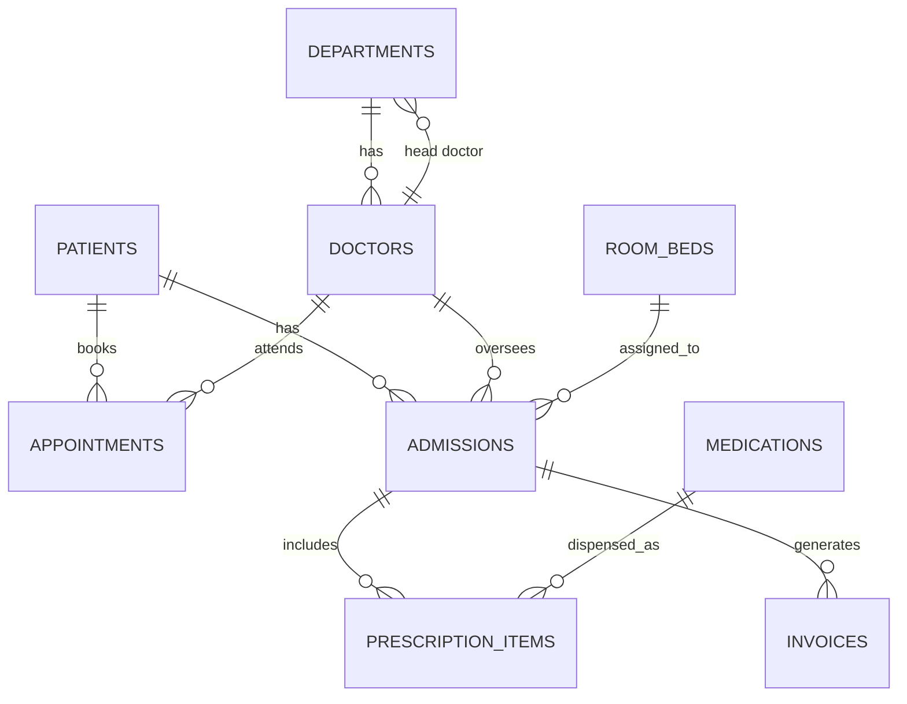
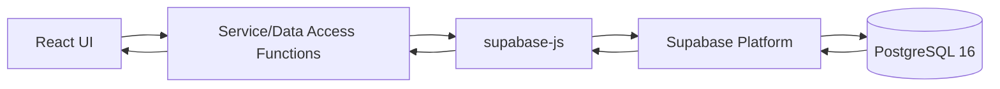
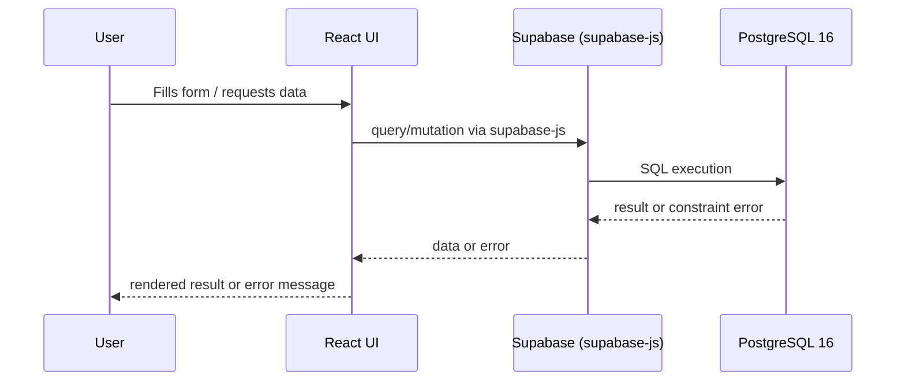
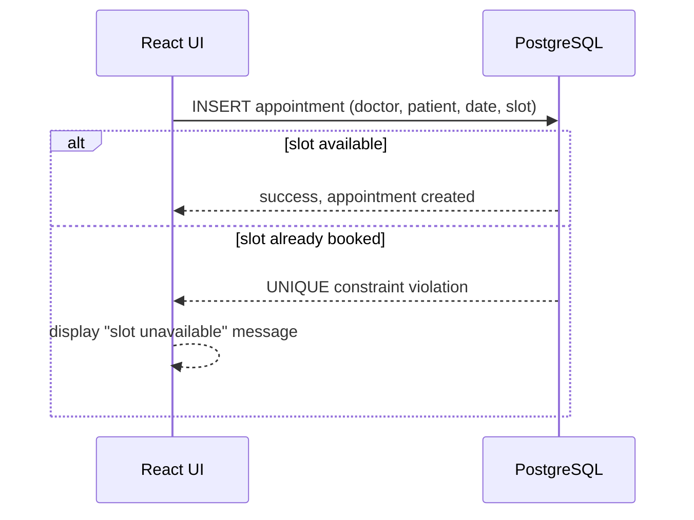
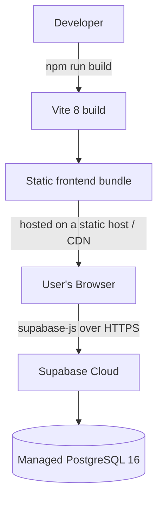

# Architecture Document — Hospital Management System (HMS)

> **Scope note:** This document reflects only what is described in the project report: a React + Supabase + PostgreSQL application. No separate Express/Node backend, microservices, or additional infrastructure are introduced. Where the report is silent on a detail, this is explicitly marked as **architectural interpretation** or a **future recommendation**, distinct from **documented behavior**.

---

## 1. System Overview

The Hospital Management System (HMS) is a **centralized relational database application** for managing hospital administrative, clinical, and financial operations. It is built as a single-page frontend (React) that communicates **directly** with a managed PostgreSQL database (Supabase) via `@supabase/supabase-js`. There is no custom application server between the frontend and the database — Supabase itself serves as the data access and hosting platform.

The system manages nine core entities — `departments`, `doctors`, `patients`, `room_beds`, `admissions`, `appointments`, `medications`, `prescription_items`, and `invoices` — spanning six functional modules: Administrative Management, Patient Management, Appointment Scheduling, Inpatient/Bed Management, Pharmacy/Inventory, and Automated Billing.

---

## 2. Architectural Goals

Documented and implied goals, based on the report:

- **Data integrity** — enforced primarily at the database layer (3NF schema, keys, constraints)
- **Correctness under concurrency** — e.g., no double-booked appointments, no overdrawn medication stock
- **Simplicity** — a direct client-to-database architecture without an intermediate custom backend
- **Automation** — business rules (bed allocation, stock updates, billing) executed as close to the data as possible via triggers/stored procedures
- **Maintainability** — a typed frontend (TypeScript) and a normalized schema (3NF)

---

## 3. Technology Stack

| Layer | Technology |
|---|---|
| Database | PostgreSQL 16 |
| Managed data platform | Supabase |
| Frontend framework | React 19 |
| Language | TypeScript 5 |
| Build tool | Vite 8 |
| Styling | Tailwind CSS v4 |
| Data access client | @supabase/supabase-js |
| Runtime (tooling) | Node.js 18+ |
| Package manager | npm |

No additional services, message queues, caches, or microservices are documented in the report.

---

## 4. High-Level Architecture



This is a two-tier architecture from an application-logic standpoint: **client (React)** and **data platform (Supabase/PostgreSQL)**. There is no separate application/business-logic server tier — that role is filled by PostgreSQL's own constraints, triggers, and stored procedures, as detailed in §8.

---

## 5. Frontend Layer

**Documented:** React 19, TypeScript 5, Vite 8, Tailwind CSS v4, and `@supabase/supabase-js` as the data access mechanism.

**Responsibilities:**
- Render UI for all six modules
- Collect user input with lightweight UX-level validation
- Issue reads/writes to Supabase
- Display data, loading/empty states, and errors returned from PostgreSQL

The frontend does not independently enforce integrity rules such as appointment uniqueness or stock limits — see `frontend.md` for detail. This is an architectural principle carried through from the report's emphasis on database-level integrity.

---

## 6. Supabase/Data Access Layer

**Documented:** Supabase is explicitly named as the managed PostgreSQL platform, accessed via `@supabase/supabase-js`.

**Role:**
- Exposes PostgreSQL tables through an auto-generated API (PostgREST, underlying Supabase's client library)
- Handles the transport between the React client and PostgreSQL
- Is the only path the frontend has to the database — there is no custom REST/GraphQL server in front of it

**Interpretation:** Supabase's built-in features (Row Level Security, Auth) are architecturally available but not confirmed as configured by the report — see §9.

---

## 7. PostgreSQL Database Layer

**Documented:** PostgreSQL 16, normalized to **3NF**, using primary keys, foreign keys, `CHECK` constraints, `UNIQUE` constraints, `ON DELETE CASCADE`, `ON DELETE SET NULL`, triggers, stored procedures, indexes, transactions, and ACID principles.

**Core entities:** `departments`, `doctors`, `patients`, `room_beds`, `admissions`, `appointments`, `medications`, `prescription_items`, `invoices`.

**Core relationships:**


This layer is the system's source of truth for both data and correctness rules — see `backend.md` for full detail on how each constraint/trigger type is used.

---

## 8. Business Logic / Database Automation Layer

The report describes automatic behavior implemented at the database level rather than in application code:

- Preventing appointment conflicts (via `UNIQUE(doctor_id, appointment_date, time_slot)`)
- Managing bed allocation and availability
- Updating medication stock on prescription issue
- Handling inpatient discharge and calculating length of stay
- Calculating room, doctor, and medication charges
- Generating consolidated billing information

**Documented behavior; exact SQL implementation (trigger/procedure bodies) should be verified against the project's actual source**, since the report describes the behaviors but not the literal code.

---

## 9. Authentication/Authorization Layer

**Not explicitly implemented per the report.** The report does not describe login, roles, sessions, or access control. This layer is therefore **planned/recommended**:

- Supabase Auth (email/password, magic link, or OAuth) as a natural fit given the existing Supabase dependency
- Row Level Security (RLS) policies on each table, scoped to authenticated roles (e.g., administrative staff, doctors, pharmacy staff)
- Route guarding in the React frontend based on the authenticated user's role

None of the above should be presented to stakeholders as already built — only as the recommended direction given the stack already in use.

---

## 10. Module Architecture

| Module | Primary Entities | Key Behaviors |
|---|---|---|
| Administrative Management | `departments`, `doctors` | Department/head doctor assignment, specialization, consultation fees |
| Patient Management | `patients` | Demographics, contact info, blood group |
| Appointment Scheduling | `appointments` | Booking, conflict prevention via `UNIQUE` constraint |
| Inpatient & Bed Management | `room_beds`, `admissions` | Ward/bed type tracking, admission, discharge |
| Pharmacy & Inventory | `medications`, `prescription_items` | Stock tracking, threshold alerts, decrement on issue |
| Automated Billing | `invoices` | Consolidation of room, doctor, and pharmacy charges at discharge |

---

## 11. Data Flow



Every module follows this same round-trip: UI → service function → `supabase-js` → Supabase → PostgreSQL, and back.

---

## 12. Main User-to-Database Interaction Flow



---

## 13. Appointment Booking Flow



Double-booking prevention is a **database-level guarantee** (documented), not a frontend check.

---

## 14. Patient Admission Flow

```mermaid
sequenceDiagram
    participant UI as React UI
    participant DB as PostgreSQL

    UI->>DB: query available beds (room_beds)
    DB-->>UI: list of available beds
    UI->>DB: INSERT admission (patient, doctor, bed)
    DB-->>DB: update bed availability (documented behavior;
    exact trigger unverified)
    DB-->>UI: admission created
```

---

## 15. Prescription/Inventory Flow

```mermaid
sequenceDiagram
    participant UI as React UI
    participant DB as PostgreSQL

    UI->>DB: INSERT prescription_item (admission, medication, qty)
    DB-->>DB: decrement medications.stock_quantity
    (documented behavior; exact implementation unverified)
    DB-->>UI: prescription recorded
```

---

## 16. Patient Discharge and Billing Flow

```mermaid
sequenceDiagram
    participant UI as React UI
    participant DB as PostgreSQL

    UI->>DB: mark admission as discharged
    DB-->>DB: calculate length of stay
    DB-->>DB: calculate room + doctor + pharmacy charges
    DB-->>DB: generate consolidated invoice
    (documented behavior; exact procedure unverified)
    DB-->>UI: invoice available for admission
```

---

## 17. Database Integrity Architecture

- **Primary keys** uniquely identify every row across all nine tables
- **Foreign keys** enforce valid references (e.g., an appointment must reference a real doctor and patient)
- **UNIQUE constraints** prevent duplicate doctor/date/time-slot appointments
- **CHECK constraints** enforce domain-level rules (exact expressions not given in the report)
- **ON DELETE CASCADE** removes dependent rows consistently (e.g., prescription items under a removed admission)
- **ON DELETE SET NULL** preserves historical records while nulling now-invalid references (e.g., a removed doctor on a past appointment)
- **Indexes** support fast lookup on foreign key and frequently filtered columns
- **3NF normalization** eliminates redundant data across all entities

---

## 18. Transaction and ACID Considerations

The report states the system uses transactions and follows ACID principles:

- **Atomicity** — multi-step operations (e.g., discharge + invoice generation) should complete fully or not at all
- **Consistency** — every committed state satisfies all keys/constraints
- **Isolation** — concurrent appointment bookings for the same doctor/slot resolve safely via the `UNIQUE` constraint rather than application-level locking
- **Durability** — committed data persists independent of client/network state afterward

---

## 19. Indexing and Performance

Indexes are documented as present; likely candidates (architectural interpretation) include:

- `appointments(doctor_id, appointment_date)` — supports both the uniqueness constraint and schedule queries
- Foreign key columns on `admissions`, `prescription_items`, and `invoices` — supports joins and lookups
- `medications(name)` — supports pharmacy search

---

## 20. Error Handling

`supabase-js` returns `{ data, error }` for every call. Constraint violations at the PostgreSQL layer (unique, foreign key, check) propagate as structured errors through Supabase to the React frontend, which is responsible for translating these into user-facing messages (e.g., "This appointment slot is no longer available").

---

## 21. Security Considerations

- Only the Supabase **anon key** should be used client-side; a service-role key must never be exposed in the browser
- Row Level Security (RLS), if configured, is the practical access-control boundary given there is no custom backend to add its own authorization layer
- Authentication/authorization itself is **planned/recommended** (§9), not confirmed as implemented

---

## 22. Deployment Architecture

**Documented/interpreted, consistent with the stack:**



The report does not name a specific hosting provider for the frontend static bundle; any static hosting is consistent with a Vite-built SPA. Supabase itself hosts the managed PostgreSQL instance.

---

## 23. Development Environment

- **Node.js 18+** and **npm** for dependency management and local tooling
- **Vite 8** dev server for local frontend development with hot module reload
- **Supabase project** (cloud-hosted or local CLI instance) providing the PostgreSQL 16 database during development
- Environment variables (`VITE_SUPABASE_URL`, `VITE_SUPABASE_ANON_KEY`) configure the client per environment

---

## 24. Future Scalability

**Recommended, not documented as current:**

- Introducing Supabase Auth/RLS for real authentication and authorization
- Read replicas or connection pooling (e.g., Supabase's built-in pooler) if concurrent load grows
- Materialized views or summary tables for reporting/analytics workloads separate from transactional tables
- Splitting a dedicated reporting/analytics layer from the operational schema if billing/administrative reporting needs grow significantly
- Formalizing trigger/stored procedure logic with automated tests once the exact SQL implementations are available

---

## Summary

This architecture is a direct, two-tier design: a React + TypeScript SPA communicating with PostgreSQL 16 through Supabase and `@supabase/supabase-js`, with no intermediate custom backend. Integrity and automation (appointment conflict prevention, bed/stock management, discharge and billing) are documented as living in the PostgreSQL layer itself, consistent with the report's emphasis on constraints, triggers, stored procedures, and ACID transactions as the system's actual source of correctness.
