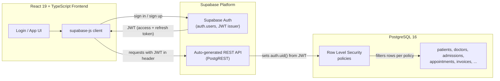
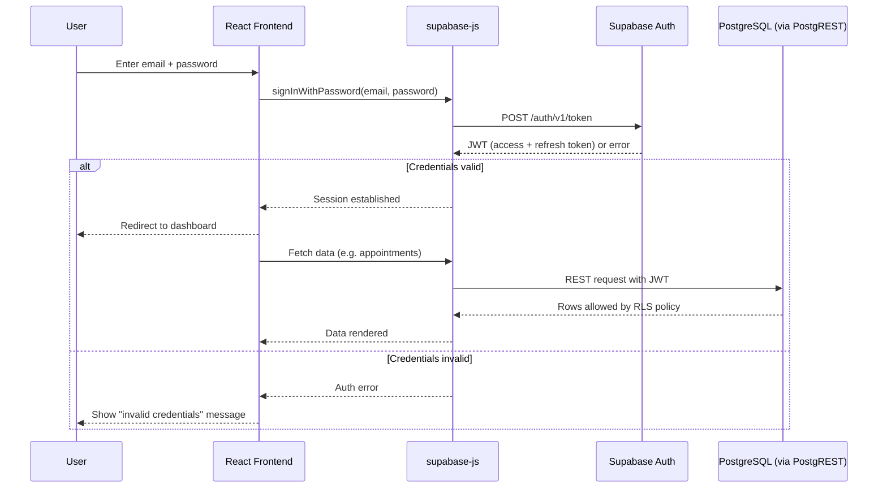
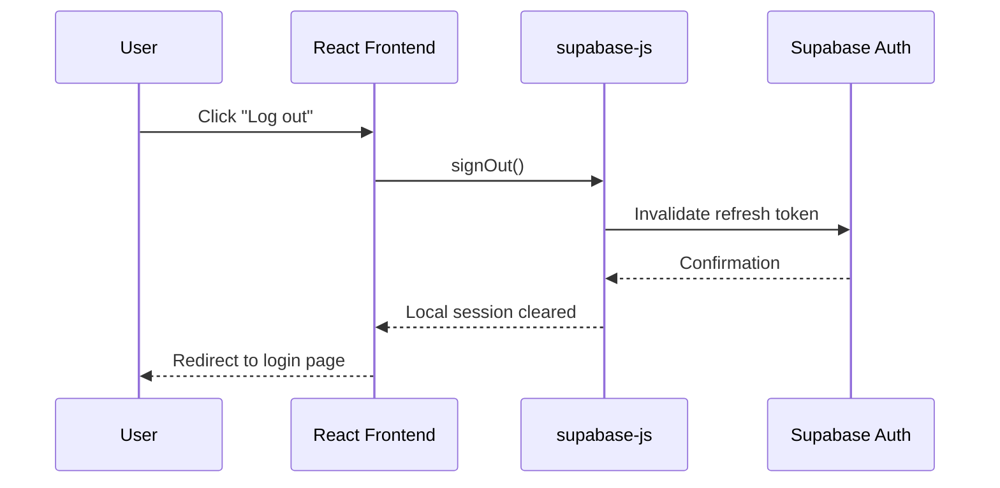
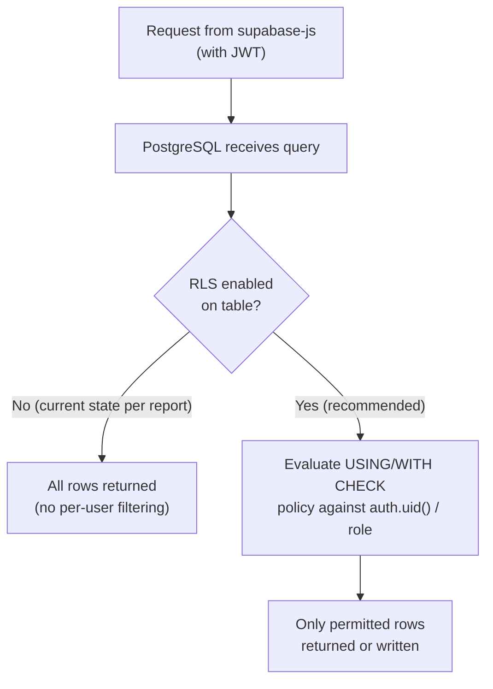

# Authentication — Hospital Management System

> **Scope note:** This document is derived from the *Hospital Management System* Database Systems (BCSE302P) project report by Anweshika Mehta and Drishti Priya. The report is a **database-design report**: its ER diagram, table definitions, and constraints cover departments, doctors, patients, rooms/beds, admissions, appointments, medications, prescription items, and invoices. **No user/auth table, no role table, no login flow, and no Row Level Security (RLS) policy is present anywhere in the report's schema or SQL excerpts.** The only authentication-related statement in the entire report is a single line in the *Project Resource Requirements* section identifying Supabase as a tool that *provides* authentication as a managed service.
>
> Every section below is explicitly labeled as either **(Documented)** — traceable to a specific statement in the report — or **(Recommended)** — a proposal for how authentication *could* be built on top of the existing schema, not something the report claims exists.

---

## 1. Authentication Overview

The Hospital Management System (HMS), as documented, is a relational database project built on PostgreSQL 16, hosted on Supabase, with a React/TypeScript frontend. The report's *Abstract* and *Project Scope* describe data modeling, constraints, triggers, and stored procedures for clinical and billing workflows (appointments, admissions, pharmacy, billing). It does **not** describe how users log in, how their identity is verified, or how access to hospital data is restricted by role.

This means that, as it stands in the report, the HMS is documented as a **data layer and schema design**, not as a secured multi-user application. Authentication and authorization are necessary for any real deployment of a system handling patient, doctor, and billing data, but the *design* of that layer is outside what the report specifies. This document therefore separates:

- What the report **explicitly says** (Section 2)
- What Supabase, as a **platform**, generally offers (Section 3 — general product capability, not project-specific implementation)
- A **recommended** architecture the project team could adopt, built to fit the existing schema (Sections 4–15)

## 2. What the Project Report Explicitly Specifies

Direct content from the report relevant to authentication:

- **Project Resource Requirements** lists: *"Supabase (managed Postgres, instant REST API, and authentication)"*. This is the only mention of authentication in the entire document.
- The **ER Diagram** and **Tables and Constraints** sections define nine tables: `departments`, `doctors`, `patients`, `rooms_beds`, `admissions`, `appointments`, `medications`, `prescription_items`, `invoices`. None of these is a users/accounts/roles table.
- The **SQL excerpts** shown (`CREATE TABLE departments`, `doctors`, `patients`, `rooms_beds`, `admissions`, `appointments`, `medications`, `prescription_items`, `invoices`, plus index definitions) contain no `auth`, `users`, `roles`, or `permissions` table, and no `CREATE POLICY` (RLS) statements.
- The **Abstract** describes triggers and stored procedures for admissions/discharge and billing business logic — not for authentication.
- The **Work Breakdown** lists Drishti Priya as "Frontend Developer & Integration Lead," implying frontend/Supabase integration work occurred, but the report gives no further detail on how that integration handles user identity.

**Explicit conclusion:** the report identifies Supabase as *capable of* providing authentication as a platform feature, but does not document that authentication, sessions, roles, or RLS were designed or implemented for this project. Any claim beyond this would not be supported by the source document.

## 3. Supabase Authentication *(Documented platform capability — not project-specific)*

Since the report names Supabase as the authentication provider by capability, it is useful to describe what Supabase Auth is, in general terms, as a product:

- Supabase Auth is a hosted authentication service bundled with a Supabase project. It manages user identities in a dedicated `auth.users` schema, separate from application tables such as `patients` or `doctors`.
- It supports email/password sign-up and sign-in, magic links, phone/OTP, and third-party OAuth providers (Google, GitHub, etc.).
- It issues JSON Web Tokens (JWTs) on successful sign-in, which are used both by `supabase-js` on the client and by PostgreSQL (via Supabase's `auth.uid()` helper function) to identify the requesting user inside Row Level Security policies.
- It exposes session management, token refresh, and password-reset endpoints, accessible via the `supabase-js` client library.

This is presented here as background on the *tool the report says is available*, not as a description of something built for the HMS project. The report gives no evidence that any of these Supabase Auth features were configured, and no `auth`-related table or policy appears in the schema.

## 4. Recommended Authentication Architecture *(Recommended)*

Given the documented stack — React 19 + TypeScript 5 + Vite 8 on the frontend, `supabase-js` as the client library, and PostgreSQL 16 on Supabase as the backend — a natural authentication architecture (not implemented in the report) would look like this:



Key points of this recommendation:

- The React frontend never talks to PostgreSQL directly; all traffic goes through Supabase's REST API (PostgREST) or `supabase-js` RPC calls, using the JWT issued by Supabase Auth.
- Row Level Security (Section 11) — not present in the current schema — becomes the actual enforcement point for "who can see/edit which hospital rows," rather than any frontend logic.
- This design fits directly onto the existing tables (`patients`, `doctors`, `admissions`, etc.) without changing their structure, by adding a separate identity/roles layer alongside them.

## 5. Session Management *(Recommended)*

Not documented in the report. A workable approach on top of Supabase Auth:

- `supabase-js` stores the session (access token + refresh token) in the browser and automatically refreshes the access token before it expires.
- The access token (a JWT) is attached to every request the client makes to Supabase's API; PostgreSQL/PostgREST reads the user's identity from it via `auth.uid()`.
- Session expiry and refresh intervals would be configured in the Supabase project's Auth settings — the report does not specify any values, so none should be assumed.
- On page reload, `supabase-js`'s `getSession()` method would be used to restore an existing session rather than forcing re-login.

## 6. User Login Flow *(Recommended)*



This flow is a proposal consistent with how `supabase-js` and Supabase Auth normally interoperate; it is not described in the report.

## 7. Logout Flow *(Recommended)*



Logging out should clear the locally cached session/token in the browser and invalidate the refresh token server-side so it cannot be reused.

## 8. Password Management *(Recommended)*

The report does not document password storage, hashing, or reset flows. If Supabase Auth is used as the identity provider (per Section 3), password hashing and storage are handled entirely by Supabase — the HMS application and its PostgreSQL tables would never store raw or hashed passwords themselves. Recommended flow components, none of which are documented in the report:

- Password reset via Supabase Auth's "forgot password" email flow, rather than any custom logic.
- Minimum password strength rules enforced client-side (UX) and, ideally, mirrored by Supabase Auth project settings.
- No storage of credentials in any HMS table (`patients`, `doctors`, etc.) — identity and credentials stay in Supabase's separate `auth.users` schema, kept apart from clinical data.

## 9. Authorization *(Recommended)*

**Authentication** answers "who is this user?" — Supabase Auth's job. **Authorization** answers "what is this user allowed to do?" — a separate concern the report does not address at all. No roles, permissions, or user-type column exists anywhere in the documented schema (`patients`, `doctors`, and `admissions` describe clinical entities, not system-user permissions).

Any authorization model for this project would need to be designed from scratch, most naturally by:
1. Introducing an identity/roles layer (Section 12) alongside the existing schema, and
2. Enforcing it at the database layer via Row Level Security (Section 11), since the frontend talks to PostgreSQL through Supabase's auto-generated API rather than a custom backend that could otherwise gate requests.

## 10. Database Security *(Recommended, with documented constraints noted)*

Documented: the schema already uses `SERIAL PRIMARY KEY`s, `NOT NULL`, `CHECK`, `UNIQUE`, and foreign-key constraints (`ON DELETE CASCADE` / `ON DELETE SET NULL`) throughout — see the report's *Tables and Constraints* section. These protect data integrity but say nothing about *who* is permitted to read or write that data.

Recommended additions, none of which are in the report:
- Keep the Supabase **service role key** (which bypasses RLS) only on trusted server-side code — never in the React frontend bundle.
- Use only the **anon public key** in the frontend, combined with RLS policies that restrict what the anon/authenticated role can actually do.
- Restrict direct database network access (Supabase's connection string) to backend/admin tooling only.

## 11. Row Level Security *(Recommended — not present in the report)*

No `CREATE POLICY` statement, and no `ENABLE ROW LEVEL SECURITY` statement, appears in any of the report's SQL excerpts. Supabase's instant REST API exposes tables directly over HTTP; **if RLS is left disabled, any table exposed this way is effectively open to anyone with the anon key**, subject only to whatever the frontend chooses to send — a real gap given the sensitivity of `patients`, `admissions`, and `invoices`.

Example of the *kind* of policy that would need to be authored (illustrative, not from the report):

```sql
-- Illustrative only — not part of the project report
ALTER TABLE patients ENABLE ROW LEVEL SECURITY;

CREATE POLICY "doctors_can_view_their_patients"
ON patients
FOR SELECT
USING (
  EXISTS (
    SELECT 1 FROM admissions
    WHERE admissions.patient_id = patients.patient_id
      AND admissions.doctor_id = (
        SELECT doctor_id FROM doctors WHERE doctors.user_id = auth.uid()
      )
  )
);
```

This example assumes a `user_id` linking column that **does not currently exist** in the `doctors` table per the report's schema — it would need to be added as part of implementing this recommendation.



## 12. Role-Based Access Control *(Proposed examples only — not implemented project roles)*

The report defines no roles table and no role column anywhere in its schema. The following roles are **illustrative proposals** for how access might reasonably be divided, based on the entities the schema already models (patients, doctors, admissions, pharmacy, billing). They are **not** roles the report specifies as implemented:

| Proposed role (example only) | Rationale, based on schema entities |
|---|---|
| Administrator | Manage `departments`, `doctors`, `rooms_beds`, `medications` |
| Doctor | View/update `appointments` and `admissions` they are assigned to |
| Receptionist / Front Desk | Create `patients`, book `appointments` |
| Pharmacist | Manage `medications` stock and `prescription_items` |
| Billing Staff | View/update `invoices` |

None of these role names, permissions, or a supporting roles table appear in the report. If adopted, they would require a new table (e.g., a `profiles` or `staff_roles` table keyed to `auth.users.id`) that the current schema does not have.

## 13. Environment Variables *(Recommended)*

Not documented in the report, but standard for a Vite + Supabase project:

```env
# Frontend (.env, safe for client bundle — Vite requires the VITE_ prefix)
VITE_SUPABASE_URL=https://<project-ref>.supabase.co
VITE_SUPABASE_ANON_KEY=<anon-public-key>

# Server-side / admin tooling only — never expose in frontend code
SUPABASE_SERVICE_ROLE_KEY=<service-role-key>
DATABASE_URL=postgresql://<user>:<password>@<host>:5432/<database>
```

The exact variable names are a convention, not something quoted from the report — the report does not include a `.env` example.

## 14. Security Risks *(Assessment based on the documented state)*

Because the report's schema contains no authentication, roles, or RLS:

- **Unrestricted data exposure risk:** if Supabase's instant REST API is enabled over these tables without RLS, `patients`, `admissions`, and `invoices` — the most sensitive tables — would be readable/writable by anyone holding the anon key, with no per-user restriction.
- **No audit trail:** there is no documented mechanism for knowing which user created, modified, or discharged a given record.
- **No separation of duties:** without roles, there is nothing stopping any client of the API from, for example, modifying `invoices.status` or `admissions.discharge_date` directly.
- **Credential handling undefined:** since no auth design is documented, there is no documented safeguard against weak passwords, credential stuffing, or session hijacking.

These are risks inherent to the *current documented state* (schema with no auth layer), not flaws claimed to exist in a deployed system — the report does not describe a deployed, publicly accessible instance.

## 15. Recommended Future Improvements *(Recommended)*

- Add an identity/roles layer (Section 12) linked to Supabase's `auth.users`, and enable Row Level Security (Section 11) on every table currently exposed via the REST API, especially `patients`, `admissions`, `invoices`, and `prescription_items`.
- Move destructive or cross-cutting operations (e.g., discharge + invoice generation, described conceptually in the report's Abstract) behind PostgreSQL functions callable only by authorized roles, rather than raw table writes from the client.
- Add server-side or database-level audit logging (created_by / updated_by columns, or a dedicated audit table) — not present in the current schema.
- Consider multi-factor authentication for administrative and billing roles, given the sensitivity of patient and financial data.
- Periodically rotate the Supabase service role key and restrict its use to trusted backend contexts only.

---

*All content in this document is based solely on the BCSE302P Hospital Management System project report. Sections marked "Recommended" or "Proposed" describe possible future work, not features the report claims to have implemented.*
