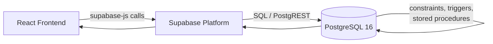
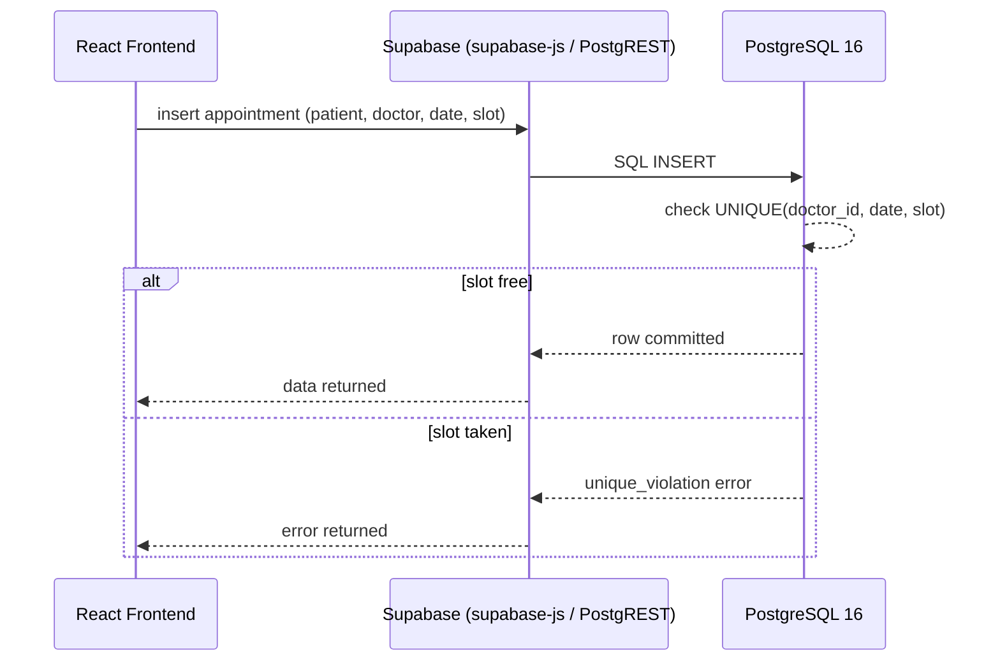

# Backend / Data Layer Architecture — Hospital Management System (HMS)

> **Architectural constraint:** The project report does **not** describe a custom application server (no Express.js, FastAPI, Spring Boot, Django, or NestJS). The documented backend is **Supabase**, a managed platform over **PostgreSQL 16**, accessed directly by the frontend through **`@supabase/supabase-js`**. This document treats "backend" as **Supabase + PostgreSQL**, not a separate application tier.

---

## 1. Overview

There is no intermediate REST/GraphQL server in this system. React communicates with PostgreSQL through the Supabase platform and its client library. PostgreSQL itself carries the enforcement burden for correctness — constraints, triggers, and stored procedures — rather than a hand-written service layer. This mirrors the report's emphasis on a centralized relational database with 3NF design, ACID guarantees, and database-level automation.



---

## 2. Frontend Logic vs. Supabase Data Access vs. PostgreSQL Business Logic

| Concern | Owner | Rationale |
|---|---|---|
| Form UX, basic input formatting | Frontend | Cosmetic/UX only, not a source of truth |
| Query/mutation dispatch | Supabase (`supabase-js`) | Transport layer between client and database |
| Uniqueness of appointment slot | PostgreSQL `UNIQUE` constraint | Must hold under concurrent requests; frontend cannot guarantee this |
| Referential integrity (e.g., an admission referencing a valid patient/doctor/bed) | PostgreSQL foreign keys | Enforced regardless of which client writes the data |
| Stock decrement on medication issue | PostgreSQL trigger/stored procedure | Must be atomic with the prescription write |
| Billing calculation (room + doctor + pharmacy charges) | PostgreSQL business logic | Consolidated invoice must reflect authoritative, already-persisted data |
| Cascading/nullifying related rows on delete | PostgreSQL `ON DELETE CASCADE` / `ON DELETE SET NULL` | Structural guarantee independent of the client |

**Principle:** anything the frontend "checks" is a convenience for the user; anything PostgreSQL enforces is the actual guarantee. The frontend should never be trusted as the last line of defense for data integrity.

---

## 3. Database Tables

- `departments`
- `doctors`
- `patients`
- `room_beds`
- `admissions`
- `appointments`
- `medications`
- `prescription_items`
- `invoices`

These map directly to the entities identified in the report, following 3NF normalization.

---

## 4. Backend/Data Responsibilities

### 4.1 Data Persistence
All hospital data (administrative, clinical, financial) is persisted centrally in PostgreSQL, accessed exclusively through Supabase.

### 4.2 CRUD Operations
Standard create/read/update/delete operations on all nine tables are performed via `supabase-js`'s PostgREST-backed query interface (`select`, `insert`, `update`, `delete`).

### 4.3 Referential Integrity
Foreign keys tie:
- `doctors.department_id → departments.id`
- `appointments.patient_id → patients.id`, `appointments.doctor_id → doctors.id`
- `admissions.patient_id → patients.id`, `admissions.doctor_id → doctors.id`, `admissions.bed_id → room_beds.id`
- `prescription_items.admission_id → admissions.id`, `prescription_items.medication_id → medications.id`
- `invoices.admission_id → admissions.id`

### 4.4 Appointment Conflict Prevention
A `UNIQUE` constraint on `(doctor_id, appointment_date, time_slot)` prevents double-booking at the database level. This is the authoritative mechanism described in the report — not application code.

```sql
-- Illustrative, consistent with the report's description:
ALTER TABLE appointments
  ADD CONSTRAINT unique_doctor_slot
  UNIQUE (doctor_id, appointment_date, time_slot);
```

### 4.5 Admission Management
`admissions` links a patient, doctor, and bed, and records admission (and later discharge) timestamps used to calculate length of stay.

### 4.6 Bed Management
`room_beds` tracks ward, bed type (ICU/General/Private), and availability. Availability should be updated as part of the same transaction that creates or closes an admission.

> **Documented behavior; exact implementation should be verified against the project SQL.** The report describes automatic bed allocation and availability tracking but does not provide the literal trigger/procedure code.

### 4.7 Medication Inventory
`medications` holds `stock_quantity` and `minimum_stock_threshold`. Issuing a medication via a `prescription_items` insert should atomically decrement stock.

> **Documented behavior; exact implementation should be verified against the project SQL.** The report states inventory is decremented when medication is issued, consistent with a trigger on `prescription_items` inserts, but the exact trigger body is not given.

### 4.8 Prescription Management
`prescription_items` links an `admission` to a `medication` with a quantity, feeding both inventory decrement and pharmacy billing.

### 4.9 Billing
`invoices` consolidates room charges, doctor charges, and pharmacy/medication charges, generated around patient discharge, per the report.

> **Documented behavior; exact implementation should be verified against the project SQL.** The precise calculation formula and whether it lives in a stored procedure, trigger, or view is not detailed in the report beyond "consolidated invoice generated around patient discharge."

### 4.10–4.15 Triggers, Stored Procedures, Transactions, Constraints, Indexes, ACID
Covered in dedicated sections below (§6–§9).

---

## 5. Core Operations

### Appointment Creation
1. Frontend submits patient, doctor, date, time slot via `supabase-js` `insert`.
2. PostgreSQL evaluates the `UNIQUE` constraint on `(doctor_id, appointment_date, time_slot)`.
3. On conflict, PostgreSQL returns a `unique_violation` error, propagated back through Supabase to the frontend.
4. On success, the row is committed and returned.

### Patient Admission
1. Frontend submits patient, doctor, bed via `insert` into `admissions`.
2. Foreign key checks confirm the patient, doctor, and bed exist.
3. Bed availability should be updated (documented behavior; exact trigger not specified in the report).

### Bed Allocation
Bed selection is presented to the user from `room_beds` filtered by availability; the authoritative "is this bed still free" check happens at insert time in PostgreSQL to avoid race conditions between concurrent admissions.

### Prescription Creation
1. Frontend inserts a row into `prescription_items` (admission, medication, quantity).
2. A database-side mechanism (documented behavior; exact implementation unverified) decrements `medications.stock_quantity`.

### Medication Stock Update
Stock changes should never be computed and pushed from the frontend as an absolute value; they should be derived by the database from the prescription event, keeping the source of truth server-side.

### Patient Discharge
1. Frontend marks an admission as discharged (e.g., sets a discharge date/status).
2. Length of stay is calculated from admission and discharge timestamps.
3. Discharge should trigger or immediately precede invoice generation.

### Invoice Generation
Room charges (based on bed type/length of stay), doctor charges (consultation fees), and pharmacy charges (from `prescription_items`) are consolidated into a single `invoices` row tied to the `admission_id`.

---

## 6. Role of Constraints and Keys

| Mechanism | Role in this system |
|---|---|
| **Primary keys** | Uniquely identify each row in all nine tables |
| **Foreign keys** | Enforce that appointments, admissions, prescriptions, and invoices only reference real departments, doctors, patients, beds, and medications |
| **UNIQUE constraints** | Prevent duplicate doctor/time-slot appointment bookings |
| **CHECK constraints** | Enforce domain rules (e.g., non-negative stock quantity, valid blood group values) — exact CHECK expressions not given in the report and should be verified |
| **ON DELETE CASCADE** | Ensures dependent rows (e.g., prescription items under an admission) are removed consistently when a parent row is deleted |
| **ON DELETE SET NULL** | Preserves historical rows (e.g., an appointment or admission) while nulling a reference if a related record (such as a doctor) is removed, rather than deleting hospital records |
| **Indexes** | Support fast lookups on frequently queried columns (doctor_id + date for appointments, patient_id for admissions, medication name for pharmacy search) |
| **Triggers** | Automate stock decrement, bed availability updates, and similar side effects at write time |
| **Stored procedures** | Encapsulate multi-step logic such as discharge processing and invoice consolidation |
| **Transactions** | Group multi-table writes (e.g., discharge + invoice generation) so they succeed or fail atomically |

---

## 7. Transactions and ACID Behavior

The report states the database follows ACID principles and uses transactions. In practice within this system:

- **Atomicity:** Multi-step operations (e.g., discharge closing an admission and generating an invoice) should be wrapped so partial failure cannot leave a patient "discharged" with no invoice, or vice versa.
- **Consistency:** Constraints (FK, UNIQUE, CHECK) ensure every committed state is structurally valid.
- **Isolation:** Concurrent appointment bookings for the same doctor/slot are resolved safely by the `UNIQUE` constraint rather than relying on application-level locking.
- **Durability:** Once PostgreSQL commits a transaction, it is persisted regardless of frontend or network state afterward.

---

## 8. Concurrency Considerations

- Appointment booking is the primary concurrency hot spot; the `UNIQUE` constraint is the safeguard against two simultaneous bookings for the same doctor/date/slot.
- Bed allocation and medication stock decrement are similarly concurrency-sensitive; both should be handled by database-side logic rather than "read stock in the frontend, then write a new value," which is vulnerable to race conditions.

---

## 9. Error Handling and Propagation

`supabase-js` returns `{ data, error }` for every call. Typical error propagation:

1. PostgreSQL raises an error (e.g., `unique_violation`, `foreign_key_violation`, `check_violation`).
2. PostgREST (inside Supabase) surfaces this as an HTTP error response with a Postgres error code.
3. `supabase-js` surfaces this as the `error` field of its response.
4. The frontend (per `frontend.md`) must check this field and present a meaningful message (e.g., "This time slot is already booked") rather than a generic failure.

The frontend must never assume success without checking `error`, since integrity failures are expected to originate at the database layer.

---

## 10. Security Considerations

- Client access should use Supabase's anon key with Row Level Security (RLS) policies restricting which rows/operations are permitted; the service-role key must remain server-side/administrative only and never reach the browser.
- Authentication/authorization is **planned/recommended**, not confirmed as implemented by the report (per `architecture.md`); until implemented, table-level RLS should be treated as the primary access boundary.
- All integrity-sensitive rules (uniqueness, stock limits, referential integrity) living in PostgreSQL means they hold even if a client bypasses the intended UI — an important defense given there is no custom backend server to add its own validation layer.

---

## 11. Performance Considerations

- Indexes on foreign key columns (`doctor_id`, `patient_id`, `bed_id`, `medication_id`, `admission_id`) support the joins implied by the relationships in §2.
- An index on `(doctor_id, appointment_date)` supports both the uniqueness constraint and typical "doctor's schedule for a day" queries.
- Pagination (`range()`/`limit()`) should be used from the frontend for large lists (patients, appointments) to avoid pulling entire tables through Supabase.

---

## 12. Data Flow Diagram



---

## 13. Summary

This system's "backend" is Supabase acting as a managed access layer in front of PostgreSQL 16. There is no separate application server documented in the report. All integrity-critical logic — appointment uniqueness, referential integrity, inventory decrement, admission/discharge handling, and billing consolidation — belongs in PostgreSQL via constraints, triggers, and stored procedures, with the exact SQL bodies for triggers/procedures needing verification against the actual project source where the report does not spell them out.
