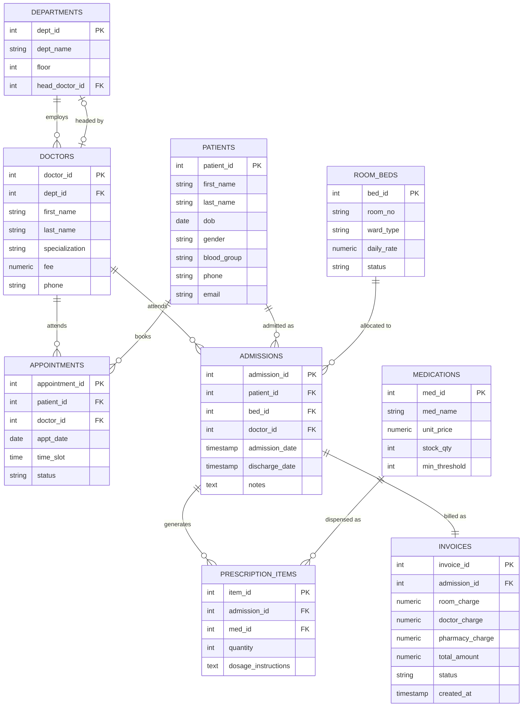

# database.md — Hospital Management System

## 1. Overview

The Hospital Management System (HMS) uses **PostgreSQL 16**, hosted on **Supabase**, as its system of record. The project report states that the schema follows **Third Normal Form (3NF)**, meaning every table is designed to eliminate repeating groups, partial dependencies, and transitive dependencies, keeping each fact stored exactly once and referenced elsewhere by foreign key.

The schema is composed of nine tables that map directly to the operational entities of a hospital: organizational structure (`departments`, `doctors`), care recipients (`patients`), physical capacity (`room_beds`), clinical events (`admissions`, `appointments`), pharmacy (`medications`, `prescription_items`), and finance (`invoices`).

> **Note on data types:** The report documents column names, keys, and constraints but does not specify exact PostgreSQL data types for every column. The `CREATE TABLE` statements below use standard, conservative type choices (e.g., `SERIAL`/`INTEGER` surrogate keys, `NUMERIC` for currency, `TEXT`/`VARCHAR` for strings, `DATE`/`TIMESTAMP` for temporal fields) that are consistent with the documented structure. Where a type choice is an inference rather than an explicit report statement, it is marked **(inferred)**.

---

## 2. Table Definitions

### 2.1 `departments`

| Column | Type (inferred) | Constraint (documented) |
|---|---|---|
| `dept_id` | `SERIAL` | PRIMARY KEY |
| `dept_name` | `VARCHAR(100)` | NOT NULL |
| `floor` | `INTEGER` | — |
| `head_doctor_id` | `INTEGER` | FOREIGN KEY → `doctors.doctor_id` |

```sql
CREATE TABLE departments (
    dept_id         SERIAL PRIMARY KEY,
    dept_name       VARCHAR(100) NOT NULL,
    floor           INTEGER,
    head_doctor_id  INTEGER,
    CONSTRAINT fk_head_doctor
        FOREIGN KEY (head_doctor_id)
        REFERENCES doctors (doctor_id)
        ON DELETE SET NULL
);
```

**Why `ON DELETE SET NULL`:** If the doctor referenced as `head_doctor_id` is removed from the system, the department itself must not disappear. Setting the reference to `NULL` preserves the department record and simply leaves it without a designated head until reassigned — this matches the documented use of `ON DELETE SET NULL` in the report.

---

### 2.2 `doctors`

| Column | Type (inferred) | Constraint (documented) |
|---|---|---|
| `doctor_id` | `SERIAL` | PRIMARY KEY |
| `dept_id` | `INTEGER` | FOREIGN KEY → `departments.dept_id` |
| `first_name` | `VARCHAR(50)` | NOT NULL |
| `last_name` | `VARCHAR(50)` | NOT NULL |
| `specialization` | `VARCHAR(100)` | — |
| `fee` | `NUMERIC(10,2)` | CHECK (`fee > 0`) |
| `phone` | `VARCHAR(20)` | — |

```sql
CREATE TABLE doctors (
    doctor_id       SERIAL PRIMARY KEY,
    dept_id         INTEGER NOT NULL,
    first_name      VARCHAR(50) NOT NULL,
    last_name       VARCHAR(50) NOT NULL,
    specialization  VARCHAR(100),
    fee             NUMERIC(10,2) NOT NULL,
    phone           VARCHAR(20),
    CONSTRAINT fk_doctor_dept
        FOREIGN KEY (dept_id)
        REFERENCES departments (dept_id)
        ON DELETE CASCADE,
    CONSTRAINT chk_fee_positive
        CHECK (fee > 0)
);
```

Because `departments.head_doctor_id` references `doctors.doctor_id` and `doctors.dept_id` references `departments.dept_id`, this pair forms a **circular foreign key relationship**. In practice this means `departments` must be created first (without a head doctor), then `doctors` created referencing it, and only then can a department row be updated to set its `head_doctor_id`.

**`fee > 0`** is the documented CHECK constraint guaranteeing every consultation fee is a positive, billable amount — a `0` or negative fee would be a data-entry error the database itself rejects.

---

### 2.3 `patients`

| Column | Type (inferred) | Constraint (documented) |
|---|---|---|
| `patient_id` | `SERIAL` | PRIMARY KEY |
| `first_name` | `VARCHAR(50)` | NOT NULL |
| `last_name` | `VARCHAR(50)` | NOT NULL |
| `dob` | `DATE` | — |
| `gender` | `VARCHAR(10)` | — |
| `blood_group` | `VARCHAR(5)` | — |
| `phone` | `VARCHAR(20)` | — |
| `email` | `VARCHAR(100)` | UNIQUE |

```sql
CREATE TABLE patients (
    patient_id   SERIAL PRIMARY KEY,
    first_name   VARCHAR(50) NOT NULL,
    last_name    VARCHAR(50) NOT NULL,
    dob          DATE,
    gender       VARCHAR(10),
    blood_group  VARCHAR(5),
    phone        VARCHAR(20),
    email        VARCHAR(100) UNIQUE
);
```

The `UNIQUE` constraint on `email` is a documented UNIQUE constraint that prevents duplicate patient registration under the same email address.

---

### 2.4 `room_beds`

| Column | Type (inferred) | Constraint (documented) |
|---|---|---|
| `bed_id` | `SERIAL` | PRIMARY KEY |
| `room_no` | `VARCHAR(10)` | NOT NULL |
| `ward_type` | `VARCHAR(30)` | — |
| `daily_rate` | `NUMERIC(10,2)` | CHECK (`daily_rate > 0`) |
| `status` | `VARCHAR(20)` | CHECK — status restriction |

```sql
CREATE TABLE room_beds (
    bed_id      SERIAL PRIMARY KEY,
    room_no     VARCHAR(10) NOT NULL,
    ward_type   VARCHAR(30),
    daily_rate  NUMERIC(10,2) NOT NULL,
    status      VARCHAR(20) NOT NULL DEFAULT 'available',
    CONSTRAINT chk_bed_status
        CHECK (status IN ('available', 'occupied', 'maintenance')),
    CONSTRAINT chk_daily_rate_positive
        CHECK (daily_rate > 0)
);
```

`status` is restricted by a CHECK constraint (a "status restriction" per the documented constraint list) to a fixed vocabulary, ensuring the application and reporting layer always see one of a known set of bed states rather than free-text values.

---

### 2.5 `admissions`

| Column | Type (inferred) | Constraint (documented) |
|---|---|---|
| `admission_id` | `SERIAL` | PRIMARY KEY |
| `patient_id` | `INTEGER` | FOREIGN KEY → `patients.patient_id` |
| `bed_id` | `INTEGER` | FOREIGN KEY → `room_beds.bed_id` |
| `doctor_id` | `INTEGER` | FOREIGN KEY → `doctors.doctor_id` |
| `admission_date` | `TIMESTAMP` | NOT NULL |
| `discharge_date` | `TIMESTAMP` | nullable until discharge |
| `notes` | `TEXT` | — |

```sql
CREATE TABLE admissions (
    admission_id    SERIAL PRIMARY KEY,
    patient_id      INTEGER NOT NULL,
    bed_id          INTEGER NOT NULL,
    doctor_id       INTEGER NOT NULL,
    admission_date  TIMESTAMP NOT NULL DEFAULT now(),
    discharge_date  TIMESTAMP,
    notes           TEXT,
    CONSTRAINT fk_admission_patient
        FOREIGN KEY (patient_id) REFERENCES patients (patient_id)
        ON DELETE CASCADE,
    CONSTRAINT fk_admission_bed
        FOREIGN KEY (bed_id) REFERENCES room_beds (bed_id),
    CONSTRAINT fk_admission_doctor
        FOREIGN KEY (doctor_id) REFERENCES doctors (doctor_id)
);
```

`admission_date` and `discharge_date` together are the basis for the report's documented length-of-stay calculation (Section 6).

---

### 2.6 `appointments`

| Column | Type (inferred) | Constraint (documented) |
|---|---|---|
| `appointment_id` | `SERIAL` | PRIMARY KEY |
| `patient_id` | `INTEGER` | FOREIGN KEY → `patients.patient_id` |
| `doctor_id` | `INTEGER` | FOREIGN KEY → `doctors.doctor_id` |
| `appt_date` | `DATE` | NOT NULL |
| `time_slot` | `TIME` | NOT NULL |
| `status` | `VARCHAR(20)` | CHECK — status restriction |
| — | — | **composite UNIQUE** (`doctor_id`, `appt_date`, `time_slot`) |

```sql
CREATE TABLE appointments (
    appointment_id  SERIAL PRIMARY KEY,
    patient_id      INTEGER NOT NULL,
    doctor_id       INTEGER NOT NULL,
    appt_date       DATE NOT NULL,
    time_slot       TIME NOT NULL,
    status          VARCHAR(20) NOT NULL DEFAULT 'scheduled',
    CONSTRAINT fk_appt_patient
        FOREIGN KEY (patient_id) REFERENCES patients (patient_id)
        ON DELETE CASCADE,
    CONSTRAINT fk_appt_doctor
        FOREIGN KEY (doctor_id) REFERENCES doctors (doctor_id),
    CONSTRAINT chk_appt_status
        CHECK (status IN ('scheduled', 'completed', 'cancelled')),
    CONSTRAINT uq_doctor_slot
        UNIQUE (doctor_id, appt_date, time_slot)
);
```

The composite `UNIQUE (doctor_id, appt_date, time_slot)` constraint is the documented conflict-prevention mechanism: PostgreSQL will reject, at the database level, any `INSERT` or `UPDATE` that would give one doctor two appointments in the same date/time slot. See Section 6.1.

---

### 2.7 `medications`

| Column | Type (inferred) | Constraint (documented) |
|---|---|---|
| `med_id` | `SERIAL` | PRIMARY KEY |
| `med_name` | `VARCHAR(100)` | NOT NULL |
| `unit_price` | `NUMERIC(10,2)` | CHECK (`unit_price > 0`) |
| `stock_qty` | `INTEGER` | CHECK (`stock_qty >= 0`) |
| `min_threshold` | `INTEGER` | — |

```sql
CREATE TABLE medications (
    med_id         SERIAL PRIMARY KEY,
    med_name       VARCHAR(100) NOT NULL,
    unit_price     NUMERIC(10,2) NOT NULL,
    stock_qty      INTEGER NOT NULL DEFAULT 0,
    min_threshold  INTEGER NOT NULL DEFAULT 0,
    CONSTRAINT chk_stock_nonnegative
        CHECK (stock_qty >= 0),
    CONSTRAINT chk_unit_price_positive
        CHECK (unit_price > 0)
);
```

`stock_qty >= 0` is a documented CHECK constraint: it is the database-level guarantee that stock can never be decremented below zero, regardless of how many prescriptions are entered concurrently. `min_threshold` supports the documented low-stock detection behavior (Section 6.3).

---

### 2.8 `prescription_items`

| Column | Type (inferred) | Constraint (documented) |
|---|---|---|
| `item_id` | `SERIAL` | PRIMARY KEY |
| `admission_id` | `INTEGER` | FOREIGN KEY → `admissions.admission_id` |
| `med_id` | `INTEGER` | FOREIGN KEY → `medications.med_id` |
| `quantity` | `INTEGER` | CHECK (`quantity > 0`) |
| `dosage_instructions` | `TEXT` | — |

```sql
CREATE TABLE prescription_items (
    item_id              SERIAL PRIMARY KEY,
    admission_id         INTEGER NOT NULL,
    med_id               INTEGER NOT NULL,
    quantity             INTEGER NOT NULL,
    dosage_instructions  TEXT,
    CONSTRAINT fk_item_admission
        FOREIGN KEY (admission_id) REFERENCES admissions (admission_id)
        ON DELETE CASCADE,
    CONSTRAINT fk_item_medication
        FOREIGN KEY (med_id) REFERENCES medications (med_id),
    CONSTRAINT chk_quantity_positive
        CHECK (quantity > 0)
);
```

`ON DELETE CASCADE` from `admissions` means that if an admission record is ever removed, its associated prescription items are removed with it — a prescription item has no independent meaning outside its admission.

---

### 2.9 `invoices`

| Column | Type (inferred) | Constraint (documented) |
|---|---|---|
| `invoice_id` | `SERIAL` | PRIMARY KEY |
| `admission_id` | `INTEGER` | FOREIGN KEY → `admissions.admission_id` |
| `room_charge` | `NUMERIC(10,2)` | — |
| `doctor_charge` | `NUMERIC(10,2)` | — |
| `pharmacy_charge` | `NUMERIC(10,2)` | — |
| `total_amount` | `NUMERIC(10,2)` | — |
| `status` | `VARCHAR(20)` | CHECK — status restriction |
| `created_at` | `TIMESTAMP` | NOT NULL, default now() |

```sql
CREATE TABLE invoices (
    invoice_id       SERIAL PRIMARY KEY,
    admission_id     INTEGER NOT NULL,
    room_charge      NUMERIC(10,2) NOT NULL DEFAULT 0,
    doctor_charge    NUMERIC(10,2) NOT NULL DEFAULT 0,
    pharmacy_charge  NUMERIC(10,2) NOT NULL DEFAULT 0,
    total_amount     NUMERIC(10,2) NOT NULL DEFAULT 0,
    status           VARCHAR(20) NOT NULL DEFAULT 'pending',
    created_at       TIMESTAMP NOT NULL DEFAULT now(),
    CONSTRAINT fk_invoice_admission
        FOREIGN KEY (admission_id) REFERENCES admissions (admission_id)
        ON DELETE CASCADE,
    CONSTRAINT chk_invoice_status
        CHECK (status IN ('pending', 'paid', 'cancelled'))
);
```

`total_amount` is documented as the sum of `room_charge + doctor_charge + pharmacy_charge` (Section 6.5).

---

## 3. Indexes

The report documents indexes on `doctors`, `admissions`, `appointments`, `prescription_items`, and `invoices`. Each supports a specific, frequently-run access pattern rather than being added speculatively:

```sql
-- doctors: fast lookup of all doctors within a department
CREATE INDEX idx_doctors_dept_id ON doctors (dept_id);

-- admissions: fast lookup of a patient's admission history,
-- a doctor's current patient load, and bed-occupancy queries
CREATE INDEX idx_admissions_patient_id ON admissions (patient_id);
CREATE INDEX idx_admissions_doctor_id  ON admissions (doctor_id);
CREATE INDEX idx_admissions_bed_id     ON admissions (bed_id);

-- appointments: fast lookup of a doctor's schedule for a given date,
-- and a patient's appointment history
CREATE INDEX idx_appointments_doctor_date ON appointments (doctor_id, appt_date);
CREATE INDEX idx_appointments_patient_id  ON appointments (patient_id);

-- prescription_items: fast lookup of every item under an admission
-- (building a pharmacy bill), and every prescription using a given medication
CREATE INDEX idx_rx_items_admission_id ON prescription_items (admission_id);
CREATE INDEX idx_rx_items_med_id       ON prescription_items (med_id);

-- invoices: fast lookup of the invoice for a given admission,
-- and filtering invoices by payment status
CREATE INDEX idx_invoices_admission_id ON invoices (admission_id);
CREATE INDEX idx_invoices_status       ON invoices (status);
```

**Purpose summary:**
- **`doctors.dept_id`** — supports "list all doctors in a department" views used during department assignment and staff directories.
- **`admissions.patient_id` / `doctor_id` / `bed_id`** — supports patient history lookups, a doctor's active caseload, and determining which admission currently occupies a bed.
- **`appointments (doctor_id, appt_date)`** — supports rendering a doctor's daily/weekly schedule, the same access pattern that the conflict-prevention UNIQUE constraint also protects.
- **`prescription_items.admission_id` / `med_id`** — supports assembling the pharmacy portion of a bill for one admission, and finding every prescription that used a specific medication (useful for stock-impact and recall queries).
- **`invoices.admission_id` / `status`** — supports the one admission → one invoice lookup, and filtering the invoice worklist by `pending`/`paid`/`cancelled`.

No additional indexes beyond these documented ones are introduced.

---

## 4. Normalization

The report states the schema is in **3NF**. Each normal form builds on the one before it:

### 4.1 First Normal Form (1NF)
A table is in 1NF when every column holds a single, atomic value and there are no repeating groups. In this schema:
- `patients` stores one `phone` and one `email` per row rather than a list of contact methods embedded in a single field.
- `prescription_items` exists as its own table specifically **because** a single admission can require multiple medications — instead of cramming a repeating group of medications into a column on `admissions`, each medication-and-quantity pair is its own row. This is the textbook justification for 1NF: repeating groups become child rows.

### 4.2 Second Normal Form (2NF)
2NF requires that every non-key attribute depend on the **whole** primary key — this only becomes a real design question when a table has a composite primary key. Every table in this schema uses a single-column surrogate key (`dept_id`, `doctor_id`, `patient_id`, etc.), so there is no composite key for a non-key attribute to partially depend on, and 2NF is satisfied by construction. The one place a composite key might have been used — `appointments (doctor_id, appt_date, time_slot)` — is instead enforced as a UNIQUE constraint over a table with its own surrogate `appointment_id` key, which keeps the 2NF reasoning simple while still enforcing the business rule.

### 4.3 Third Normal Form (3NF)
3NF requires that non-key attributes depend on **nothing but** the primary key — i.e., no transitive dependencies. This is where the report's stated design choices are most visible:
- `doctors` does **not** store `dept_name` or `floor`; it stores only `dept_id`, and the department's name/floor are looked up through `departments`. Storing `dept_name` directly on `doctors` would make it transitively dependent on `dept_id` rather than on `doctor_id`.
- `admissions` does **not** store patient name, doctor fee, or bed rate; it stores `patient_id`, `doctor_id`, `bed_id` and those tables are the single source of truth for those facts.
- `invoices` does **not** store the doctor's fee or the bed's daily rate directly — it stores computed `room_charge` and `doctor_charge` values derived at billing time from `room_beds.daily_rate` and `doctors.fee`, while the identity of *which* doctor/bed is reached transitively through `admissions`.
- `prescription_items` does **not** store `unit_price`; it references `med_id` and the price is looked up from `medications` at billing time.

### 4.4 Why this reduces redundancy and preserves integrity
Separating `doctors`, `departments`, `patients`, `medications`, `admissions`, `prescription_items`, and `invoices` into distinct tables means every fact (a doctor's fee, a medication's unit price, a patient's blood group) is stored in exactly one place. This has two direct, documented consequences:
1. **No update anomalies** — raising a doctor's `fee` in `doctors` instantly and correctly affects every future `doctor_charge` calculation without having to find and update copies of that fee scattered across `admissions` or `invoices` rows.
2. **No insertion/deletion anomalies** — a department can exist with zero doctors, a medication can exist with zero prescriptions, and deleting a completed admission's downstream `prescription_items`/`invoices` (via `ON DELETE CASCADE`) does not corrupt `medications` or `doctors`, which remain independent master data.

---

## 5. Relationships and Cardinality

| Relationship | Cardinality | Enforced by |
|---|---|---|
| Department → Doctors | 1 department : many doctors | `doctors.dept_id` FK |
| Department → Head Doctor | 1 department : 1 doctor (optional) | `departments.head_doctor_id` FK |
| Patient → Appointments | 1 patient : many appointments | `appointments.patient_id` FK |
| Doctor → Appointments | 1 doctor : many appointments | `appointments.doctor_id` FK |
| Patient → Admissions | 1 patient : many admissions | `admissions.patient_id` FK |
| Doctor → Admissions | 1 doctor : many admissions | `admissions.doctor_id` FK |
| Bed → Admissions | 1 bed : many admissions (over time) | `admissions.bed_id` FK |
| Admission → Prescription Items | 1 admission : many prescription items | `prescription_items.admission_id` FK |
| Medication → Prescription Items | 1 medication : many prescription items | `prescription_items.med_id` FK |
| Admission → Invoice | 1 admission : 1 invoice | `invoices.admission_id` FK |

**Reading the ER diagram onto the relational schema:** every "many" side in the diagram corresponds to a foreign-key column living on the "many" table pointing back to the "one" table's primary key. The **Bed → Admissions** relationship is one-to-many *over time* rather than concurrently — `room_beds.status` is what prevents two *simultaneous* admissions from occupying the same bed (see Section 6.2), even though the foreign key itself does not limit how many historical admission rows reference a given `bed_id`. The **Admission → Invoice** relationship is modeled as one-to-one at the application level: exactly one invoice is generated per admission once billing is finalized, even though the foreign key constraint alone permits multiple invoice rows per admission.

### 5.1 Mermaid ER Diagram



---

## 6. Database-Level Business Logic

### 6.1 Appointment Conflict Prevention
The report documents the composite `UNIQUE (doctor_id, appt_date, time_slot)` constraint on `appointments` as the mechanism preventing double-booking. Rather than relying on application code to check availability before inserting, the database itself rejects a conflicting insert:

```sql
INSERT INTO appointments (patient_id, doctor_id, appt_date, time_slot, status)
VALUES (12, 4, '2026-10-02', '10:30', 'scheduled');
-- Fails with a unique_violation if doctor_id 4 already has
-- an appointment at 2026-10-02 10:30, regardless of which patient.
```

This makes conflict prevention **atomic and race-condition-safe**: even if two requests to book the same doctor/date/slot arrive at nearly the same instant, PostgreSQL guarantees only one of the two `INSERT`s succeeds.

### 6.2 Bed Allocation
Bed allocation is coordinated through `room_beds.status`. A bed's `status` (`available` / `occupied` / `maintenance`) reflects whether it is currently assignable. When an admission is created against a bed, the bed's status is expected to move to `occupied`; on discharge, it returns to `available`. The `status` CHECK constraint guarantees the value is always one of the recognized states, so downstream queries filtering `WHERE status = 'available'` never miss or misclassify a bed due to a stray or malformed status value.

### 6.3 Medication Inventory Decrement
Each `prescription_items` row records a `quantity` of a given `med_id` dispensed against an admission. The documented relationship is that dispensing a prescription item reduces `medications.stock_qty` by that `quantity`. The `stock_qty >= 0` CHECK constraint is the database's final backstop: it guarantees stock can never be decremented past zero, so a prescription that would over-draw inventory is rejected rather than silently producing a negative stock figure.

**Low-stock detection** compares the current `stock_qty` against `min_threshold` on the same row — any medication where `stock_qty <= min_threshold` is flagged as needing reorder.

### 6.4 Inpatient Discharge and Length-of-Stay
Discharge is recorded by setting `admissions.discharge_date`. The documented **length-of-stay (LOS)** calculation is the difference between `discharge_date` and `admission_date`:

```sql
SELECT
    admission_id,
    admission_date,
    discharge_date,
    (discharge_date::date - admission_date::date) AS length_of_stay_days
FROM admissions
WHERE admission_id = 501;
```

### 6.5 Billing Calculation
The report documents `invoices.total_amount` as the sum of three components, each computed from a different part of the schema:

- **Room charges** = `length_of_stay_days × room_beds.daily_rate` for the bed used in the admission.
- **Doctor charges** = the attending `doctors.fee` for the admission (per the documented `doctor_charge` column).
- **Medication charges** = `SUM(prescription_items.quantity × medications.unit_price)` across every prescription item tied to the admission.

```sql
-- Pharmacy charge for one admission
SELECT SUM(pi.quantity * m.unit_price) AS pharmacy_charge
FROM prescription_items pi
JOIN medications m ON m.med_id = pi.med_id
WHERE pi.admission_id = 501;
```

```sql
-- total_amount is the sum of the three components
UPDATE invoices
SET total_amount = room_charge + doctor_charge + pharmacy_charge
WHERE admission_id = 501;
```

---

## 7. Triggers and Stored Procedures

The report references database-level automation supporting the above business logic but does not provide exact trigger or procedure names. Documented **purposes** (not implementation names) include:

- **A stock-decrement mechanism** tied to the insertion of `prescription_items` rows, keeping `medications.stock_qty` synchronized with what has actually been prescribed, rather than relying solely on application code to remember to update it.
- **A bed-status synchronization mechanism** tied to admission creation and discharge, so `room_beds.status` reflects occupancy without a separate manual update step.
- **A billing calculation routine** invoked at discharge time that reads the admission's dates, bed rate, doctor fee, and prescription items, and writes the resulting `room_charge`, `doctor_charge`, `pharmacy_charge`, and `total_amount` into `invoices`.

Because the report does not give these routines specific names or exact PL/pgSQL bodies, this document describes their **documented purpose and inputs/outputs only** and does not assert specific function or trigger identifiers.

---

## 8. Transactions and ACID

Several HMS operations touch multiple tables and must succeed or fail as a unit:

- **Appointment booking** — a single-row `INSERT` into `appointments`. **Atomicity** here is delivered by the UNIQUE constraint: the statement either fully succeeds or is fully rejected, with no partial "half-booked" state possible. **Isolation** ensures two simultaneous booking attempts for the same slot cannot both see the slot as free and both succeed.

- **Admission** — creating an `admissions` row and updating the corresponding `room_beds.status` to `occupied` should be wrapped in a single transaction:
```sql
BEGIN;
INSERT INTO admissions (patient_id, bed_id, doctor_id, admission_date)
VALUES (12, 7, 4, now());
UPDATE room_beds SET status = 'occupied' WHERE bed_id = 7;
COMMIT;
```
  If the bed-status update failed after the admission insert succeeded, the system would show a bed as `available` while it is actually occupied — **atomicity** across both statements prevents that inconsistency.

- **Medication stock updates** — decrementing `stock_qty` when a `prescription_items` row is inserted must happen within the same transaction as the insert itself, so a prescription is never recorded without the corresponding stock reduction (or vice versa). The `stock_qty >= 0` CHECK constraint additionally protects **consistency**: even under a transaction bug, the database will not commit a negative stock value.

- **Discharge** — setting `discharge_date`, updating `room_beds.status` back to `available`, and generating the `invoices` row are logically one unit of work. Wrapping them in a transaction ensures a patient cannot be marked discharged while their bed remains `occupied`, or vice versa.

- **Invoice generation** — computing and writing `room_charge`, `doctor_charge`, `pharmacy_charge`, and `total_amount` together, so an invoice is never left in a state where only some of its components have been calculated.

**Durability** is provided by PostgreSQL's write-ahead logging on Supabase's managed infrastructure — once any of the above transactions commits, the result survives a crash or restart.

### 8.1 Concurrency Concerns
- **Double booking** — addressed structurally by the `UNIQUE (doctor_id, appt_date, time_slot)` constraint rather than by application-side locking; PostgreSQL's own row-level conflict detection at `INSERT` time is the safeguard.
- **Double allocation of a bed** — two concurrent admission requests for the same bed must not both succeed. Since the schema does not document a UNIQUE constraint on `bed_id` within `admissions`, the report's implication is that this must be protected either by checking `room_beds.status = 'available'` inside the same transaction as the `INSERT` (relying on row-level locking via `SELECT ... FOR UPDATE` on the bed row), or by application-level serialization — the report does not specify the exact mechanism, so this is flagged as a concurrency concern rather than a fully documented safeguard.
- **Concurrent stock decrements** — two prescriptions for the same medication submitted at the same time must not both read the same pre-decrement `stock_qty` and each subtract from it independently (a classic lost-update problem). The `stock_qty >= 0` CHECK constraint guarantees the *final* value is never invalid, but correct arithmetic under concurrency depends on the decrement being performed as an atomic `UPDATE ... SET stock_qty = stock_qty - :qty` (which PostgreSQL executes as a single row-locking operation) rather than a read-then-write from the application.
