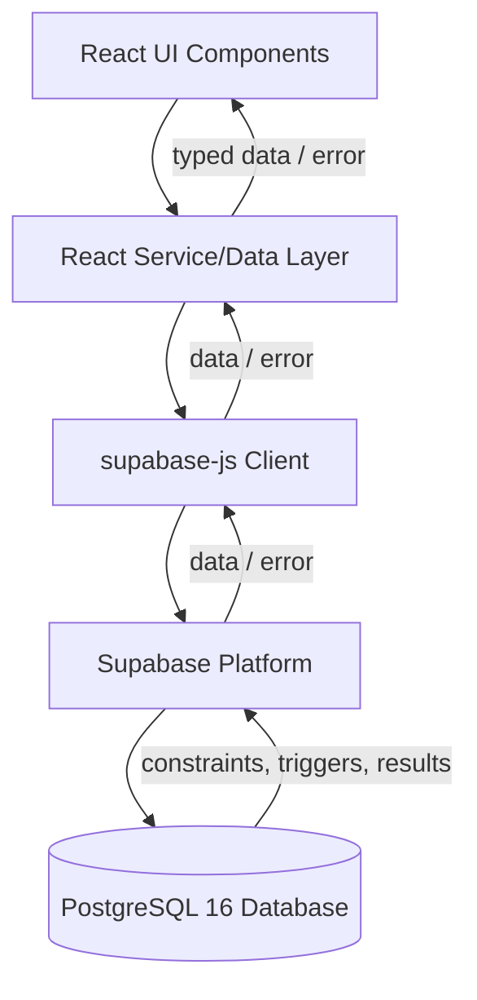

# Frontend Architecture — Hospital Management System (HMS)

> **Scope note:** This document describes the frontend layer only, consistent with the technology stack and modules defined in the project report and with `architecture.md`. Where the report does not explicitly define a UI page or component, this document presents it as a **recommended implementation** consistent with the stack, not as an existing artifact.

---

## 1. Frontend Overview

The frontend is a **single-page application (SPA)** built with **React 19** and **TypeScript 5**, bundled with **Vite 8**, and styled with **Tailwind CSS v4**. It has no custom backend server of its own — it communicates directly with **Supabase** (a managed PostgreSQL platform) through the **`@supabase/supabase-js`** client library.

The frontend's job is to provide a usable interface over the nine core relational entities (`departments`, `doctors`, `patients`, `room_beds`, `admissions`, `appointments`, `medications`, `prescription_items`, `invoices`) while deferring all integrity-critical decisions (uniqueness, stock limits, cascades) to PostgreSQL.

---

## 2. Frontend Responsibilities

The frontend is responsible for:

- Rendering forms and views for the nine core entities
- Collecting and lightly validating user input before submission
- Issuing queries and mutations via `supabase-js`
- Displaying data, loading states, empty states, and errors returned by Supabase/PostgreSQL
- Reflecting **database-enforced outcomes** (e.g., a rejected duplicate appointment) back to the user as clear messages

The frontend is explicitly **not** responsible for:

- Enforcing uniqueness of appointment slots (owned by a PostgreSQL `UNIQUE` constraint)
- Enforcing minimum/maximum stock rules (owned by PostgreSQL constraints/triggers)
- Guaranteeing referential integrity (owned by foreign keys, `ON DELETE CASCADE` / `ON DELETE SET NULL`)
- Calculating final, authoritative billing totals (owned by PostgreSQL business logic, per `architecture.md`)

---

## 3. Technology Stack

| Layer | Technology | Notes |
|---|---|---|
| UI library | React 19 | Component-based SPA |
| Language | TypeScript 5 | Static typing across components and data access |
| Build tool | Vite 8 | Dev server + production bundling |
| Styling | Tailwind CSS v4 | Utility-first styling |
| Data access | `@supabase/supabase-js` | Direct client-to-Supabase communication |
| Runtime | Node.js 18+ | Local dev/build tooling only |
| Package manager | npm | Dependency management |

No additional frameworks (Next.js, Redux, React Query, Axios, Material UI, etc.) are documented in the report. Any mention of such tools below is explicitly flagged as an **optional future recommendation**, not part of the current stack.

---

## 4. Recommended React Project Structure

This structure is a **reasonable architectural interpretation**, not something the report specifies at file level:

```
src/
├── main.tsx
├── App.tsx
├── lib/
│   └── supabaseClient.ts        # supabase-js client initialization
├── types/
│   └── database.ts              # TypeScript types mirroring DB tables
├── services/                    # data-access functions per entity
│   ├── departments.ts
│   ├── doctors.ts
│   ├── patients.ts
│   ├── appointments.ts
│   ├── beds.ts
│   ├── admissions.ts
│   ├── medications.ts
│   ├── prescriptions.ts
│   └── invoices.ts
├── components/                  # reusable UI (forms, tables, dialogs)
├── pages/                       # route-level views, one per module
└── styles/
    └── index.css                # Tailwind entry
```

---

## 5. Component Architecture

Recommended layering:

1. **Page components** — one per module/route, orchestrate data fetching and compose feature components.
2. **Feature components** — forms, tables, and detail views specific to an entity (e.g., `PatientForm`, `AppointmentTable`).
3. **Shared/UI components** — buttons, inputs, modals, loading spinners, alerts — reused across modules.
4. **Service layer** — plain TypeScript functions wrapping `supabase-js` calls, isolating Supabase-specific code from components.

This separation keeps components focused on presentation while the service layer owns query construction.

---

## 6. Page/Route Structure

A recommended route map (interpretation, not documented literally in the report):

| Route | Module |
|---|---|
| `/departments` | Administrative Management |
| `/doctors` | Doctor Management |
| `/patients` | Patient Management |
| `/appointments` | Appointment Scheduling |
| `/beds` | Bed Management |
| `/admissions` | Inpatient Management |
| `/pharmacy` | Pharmacy & Inventory |
| `/prescriptions` | Prescription Management |
| `/billing` | Billing / Invoices |

Routing library is not specified in the report; React's built-in mechanisms or a lightweight router may be used.

---

## 7. Module-wise UI Responsibilities

Each module maps to CRUD-style screens over its corresponding table(s), plus module-specific workflows (booking, admission, dispensing, discharge/billing).

### 8. Department Management UI
- List departments with head doctor
- Create/edit department, assign head doctor (`doctors.department_id` relationship)

### 9. Doctor Management UI
- List/search doctors by department and specialization
- Create/edit doctor profile, specialization, consultation fee

### 10. Patient Management UI
- List/search patients
- Create/edit patient demographic, contact, and blood group information

### 11. Appointment Management UI
- Calendar/list view of appointments by doctor/date
- Booking form (patient, doctor, date, time slot)
- Surface database rejection of conflicting slots as a user-facing error (see §17)

### 12. Bed Management UI
- View bed availability by ward and type (ICU/General/Private)
- Reflect real-time occupancy state from `room_beds`

### 13. Admission Management UI
- Admit patient: select patient, doctor, bed
- View active admissions and length of stay
- Discharge action, triggering downstream billing (per `backend.md`)

### 14. Pharmacy/Medication UI
- Medication catalog list with stock and minimum threshold
- Highlight low-stock items (display-only warning, not a hard block — see §18)

### 15. Prescription UI
- Create prescription items linked to an admission
- Select medication and quantity; submit to PostgreSQL for stock decrement

### 16. Billing/Invoice UI
- View consolidated invoice per admission (room, doctor, pharmacy charges)
- Read-only presentation of PostgreSQL-calculated totals

---

## 17. Forms and Validation

Frontend validation should be **advisory and UX-focused only**:

- Required fields, format checks (e.g., phone number pattern, date validity)
- Basic range checks (e.g., quantity > 0)

Frontend validation must **not** be relied upon for:

- Preventing duplicate appointment slots — this is enforced by a `UNIQUE` constraint on `doctor_id` + appointment date + time slot at the database level
- Preventing medication stock from going negative — this is enforced by database constraints/triggers

The UI should always be prepared to receive and display a rejection from PostgreSQL even if client-side validation passed.

## 18. Table/List Views
Paginated or filterable tables for departments, doctors, patients, appointments, admissions, medications, and invoices, typically backed by `select()` queries with `range()`/`order()`.

## 19. Loading States
Every data-fetching component should track an explicit loading boolean/state while awaiting `supabase-js` promises, showing a spinner or skeleton.

## 20. Empty States
Lists should distinguish "still loading" from "loaded, zero rows" (e.g., "No appointments scheduled for this doctor today").

## 21. Error Handling
Every `supabase-js` call returns `{ data, error }`. Components must check `error` and surface a readable message — especially for constraint violations (e.g., duplicate appointment, insufficient stock) rather than a generic failure.

## 22. Confirmation Dialogs
Recommended before destructive or consequential actions: deleting a doctor/patient, discharging a patient, cancelling an appointment.

---

## 23. Supabase Client Usage

```ts
// lib/supabaseClient.ts
import { createClient } from '@supabase/supabase-js';

const supabaseUrl = import.meta.env.VITE_SUPABASE_URL;
const supabaseAnonKey = import.meta.env.VITE_SUPABASE_ANON_KEY;

export const supabase = createClient(supabaseUrl, supabaseAnonKey);
```

## 24. Database Query Patterns

**Fetching patients:**
```ts
export async function getPatients() {
  const { data, error } = await supabase
    .from('patients')
    .select('*')
    .order('created_at', { ascending: false });

  if (error) throw error;
  return data;
}
```

**Creating an appointment** (database uniqueness, not frontend logic, prevents duplicates):
```ts
export async function createAppointment(appointment: {
  patient_id: string;
  doctor_id: string;
  appointment_date: string;
  time_slot: string;
}) {
  const { data, error } = await supabase
    .from('appointments')
    .insert(appointment)
    .select()
    .single();

  if (error) {
    // A unique_violation here means the slot is already booked —
    // this is enforced by the database, not the UI.
    throw error;
  }
  return data;
}
```

**Updating a patient:**
```ts
export async function updatePatient(id: string, updates: Partial<Patient>) {
  const { data, error } = await supabase
    .from('patients')
    .update(updates)
    .eq('id', id)
    .select()
    .single();

  if (error) throw error;
  return data;
}
```

**Retrieving available beds:**
```ts
export async function getAvailableBeds(wardId?: string) {
  let query = supabase
    .from('room_beds')
    .select('*')
    .eq('is_available', true);

  if (wardId) query = query.eq('ward_id', wardId);

  const { data, error } = await query;
  if (error) throw error;
  return data;
}
```

**Creating an admission:**
```ts
export async function createAdmission(admission: {
  patient_id: string;
  doctor_id: string;
  bed_id: string;
  admission_date: string;
}) {
  const { data, error } = await supabase
    .from('admissions')
    .insert(admission)
    .select()
    .single();

  if (error) throw error;
  return data;
}
```

**Retrieving medication stock:**
```ts
export async function getMedicationStock() {
  const { data, error } = await supabase
    .from('medications')
    .select('id, name, stock_quantity, minimum_stock_threshold')
    .order('name');

  if (error) throw error;
  return data;
}
```

**Retrieving invoices:**
```ts
export async function getInvoiceByAdmission(admissionId: string) {
  const { data, error } = await supabase
    .from('invoices')
    .select('*')
    .eq('admission_id', admissionId)
    .single();

  if (error) throw error;
  return data;
}
```

---

## 25. State Management

The report does not document a dedicated state management library (e.g., Redux). Local component state (`useState`) plus the service-layer functions above is sufficient for CRUD-style screens. Global state, if ever needed, is a **future recommendation**, not a current requirement.

## 26. TypeScript Types

Types should mirror the nine database tables, e.g.:

```ts
export interface Patient {
  id: string;
  first_name: string;
  last_name: string;
  date_of_birth: string;
  blood_group: string;
  phone: string;
  address: string;
  created_at: string;
}

export interface Appointment {
  id: string;
  patient_id: string;
  doctor_id: string;
  appointment_date: string;
  time_slot: string;
  status: string;
}
```

Exact columns should be verified against the project's actual SQL schema; the fields above reflect the entities and attributes described in the report at a conceptual level.

## 27. Environment Variables

```
VITE_SUPABASE_URL=<supabase-project-url>
VITE_SUPABASE_ANON_KEY=<supabase-anon-key>
```

These are consumed via `import.meta.env` (Vite convention) and must never include a service-role key on the client.

## 28. Security Considerations

- Only the **anon key** should be used in the frontend; the service-role key must never ship to the browser.
- Row Level Security (RLS) policies on Supabase, if configured, govern what the anon key can actually read/write — the frontend should assume PostgreSQL/Supabase is the final authority, not the UI's own logic.
- Authentication/authorization is **planned/recommended** per `architecture.md`, not confirmed as implemented in the report; frontend route guarding should be treated as a future addition rather than an existing feature.

## 29. Responsive Design

Tailwind CSS v4's responsive utility classes (`sm:`, `md:`, `lg:`) should be used to ensure tables and forms remain usable on tablet-sized devices likely used at hospital workstations and nursing stations.

## 30. Accessibility

Recommended baseline: semantic HTML form elements, visible focus states, label associations for all inputs, and sufficient color contrast for status indicators (e.g., bed availability, low stock).

## 31. Frontend-to-Database Data Flow



All reads and writes flow through this same path. Business-critical rules (appointment uniqueness, stock limits, cascading deletes, billing calculations) are enforced at the PostgreSQL layer (E), not in the React UI or service layer — the frontend's role is to present data and gracefully handle whatever PostgreSQL, via Supabase, returns.
