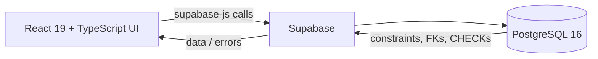
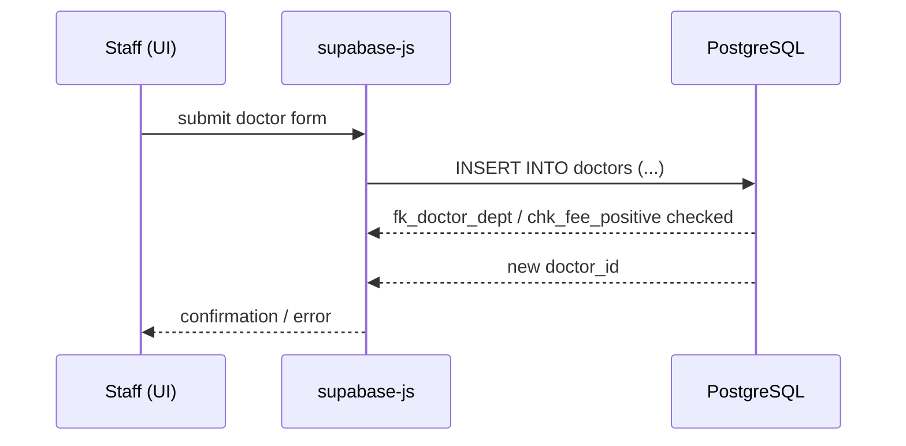
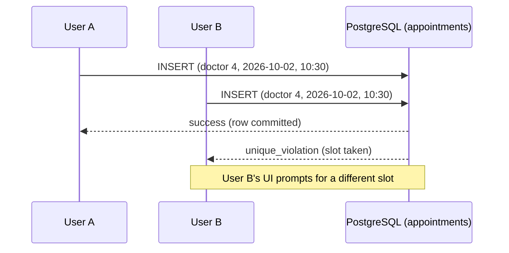
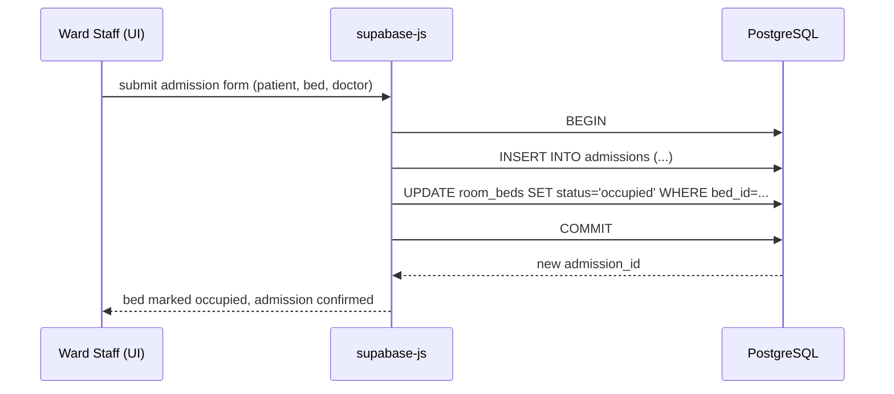
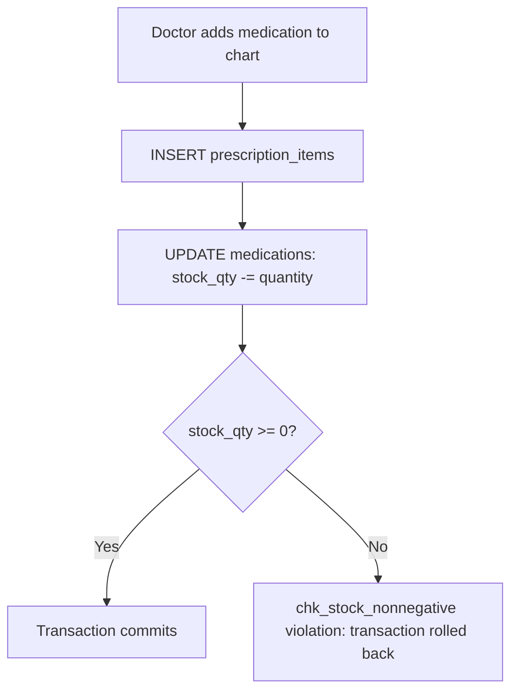
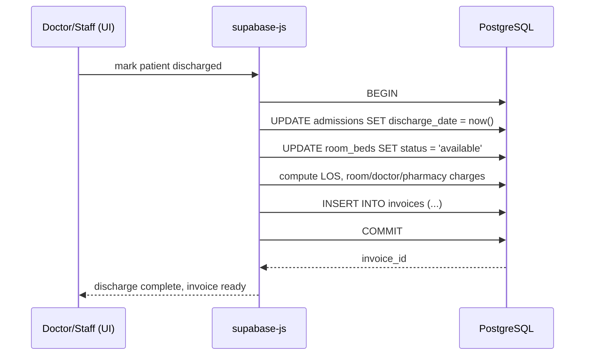
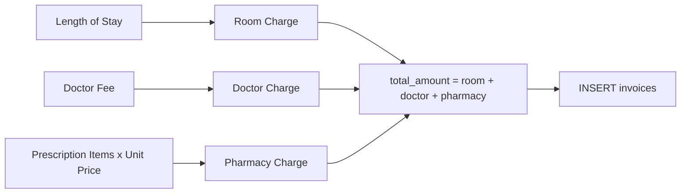

# orchestration.md — Hospital Management System

## 1. Scope of This Document

"Orchestration" in this document refers to how the Hospital Management System's **modules and database operations** coordinate with one another — department assignment feeding into doctor registration, appointment booking feeding into the conflict-prevention constraint, admission feeding into bed allocation and eventually billing, and so on. **This is not an AI agent system, and none of the workflows below describe agentic or LLM-driven decision-making.** Every workflow is a conventional web-application flow: a user action in the React frontend triggers a `supabase-js` call against PostgreSQL, and the database's own constraints, foreign keys, and (where documented) triggers enforce correctness.

## 2. Technology Stack and How the Pieces Fit Together

| Layer | Technology | Role |
|---|---|---|
| UI | React 19 + TypeScript 5 | Renders module screens (registration forms, schedules, admission board, pharmacy, billing) |
| Build tooling | Vite 8 | Dev server and bundling |
| Styling | Tailwind CSS v4 | Utility-first styling for all module UIs |
| Data access | `supabase-js` | Issues queries/mutations against Supabase's PostgreSQL REST/RPC interface |
| Database | PostgreSQL 16 on Supabase | System of record; enforces constraints described in `database.md` |

The React application does not talk to a separate custom backend server — module coordination happens by the frontend issuing sequenced `supabase-js` calls, with PostgreSQL's constraints (foreign keys, CHECKs, the appointment UNIQUE constraint) acting as the final arbiter of correctness whenever two modules' actions could otherwise conflict.



---

## 3. Workflows

### 3.1 Doctor Registration

- **Trigger:** Admin/staff submits the "Add Doctor" form.
- **Input:** `first_name`, `last_name`, `specialization`, `fee`, `phone`, `dept_id`.
- **Validation:** Frontend checks required fields and that `fee` is a positive number before submission.
- **Database operation:** `INSERT` into `doctors`.
- **Constraints involved:** `fk_doctor_dept` (the chosen department must already exist), `chk_fee_positive` (`fee > 0`).
- **Trigger/procedure involvement:** None documented.
- **Transaction considerations:** Single-row insert; no multi-table coordination required unless the new doctor is immediately being set as a department's head (see 3.2).
- **Output:** New `doctor_id`, doctor now selectable in appointment/admission/department-assignment screens.
- **Error scenarios:** `dept_id` referencing a non-existent department → foreign-key violation; `fee <= 0` → check violation; both surfaced to the UI as validation errors.



---

### 3.2 Department Assignment

- **Trigger:** A doctor is assigned to a department at registration, moved between departments, or designated as a department's head doctor.
- **Input:** `dept_id` (on `doctors`) or `head_doctor_id` (on `departments`).
- **Validation:** The target doctor must belong to (or be eligible to lead) the department being updated.
- **Database operation:** `UPDATE doctors SET dept_id = ...` for reassignment, or `UPDATE departments SET head_doctor_id = ...` for head-doctor designation.
- **Constraints involved:** `fk_doctor_dept`; `fk_head_doctor` with `ON DELETE SET NULL` (so removing a head doctor later does not delete the department).
- **Trigger/procedure involvement:** None documented.
- **Transaction considerations:** Reassigning a doctor's department and updating a department's head are independent single-row updates; no compound transaction is documented as necessary between them.
- **Output:** Department roster and department "head" field reflect the change immediately.
- **Error scenarios:** Setting `head_doctor_id` to a doctor who does not exist → FK violation.

---

### 3.3 Patient Registration

- **Trigger:** Front-desk staff submits the "Register Patient" form.
- **Input:** `first_name`, `last_name`, `dob`, `gender`, `blood_group`, `phone`, `email`.
- **Validation:** Required fields present; email format checked client-side before submission.
- **Database operation:** `INSERT` into `patients`.
- **Constraints involved:** `UNIQUE` on `email`.
- **Trigger/procedure involvement:** None documented.
- **Transaction considerations:** Single-row insert.
- **Output:** New `patient_id`, patient now selectable for appointments and admissions.
- **Error scenarios:** Duplicate `email` → unique-constraint violation, surfaced as "a patient with this email already exists."

---

### 3.4 Appointment Booking

- **Trigger:** Staff or patient-facing UI submits a new appointment request.
- **Input:** `patient_id`, `doctor_id`, `appt_date`, `time_slot`.
- **Validation:** Frontend may pre-filter the doctor's already-booked slots for that date to present only open slots, but this is a UX convenience, not the source of truth.
- **Database operation:** `INSERT` into `appointments` with `status = 'scheduled'`.
- **Constraints involved:** `uq_doctor_slot` — the composite `UNIQUE (doctor_id, appt_date, time_slot)` constraint — plus `chk_appt_status`.
- **Trigger/procedure involvement:** None documented; conflict prevention is delegated entirely to the UNIQUE constraint rather than a trigger.
- **Transaction considerations:** Single-row insert; the UNIQUE constraint makes the insert itself atomic and self-protecting under concurrent requests (see 3.5).
- **Output:** New `appointment_id`; slot now shown as taken for that doctor/date/time.
- **Error scenarios:** Insert into an already-taken `(doctor_id, appt_date, time_slot)` → `unique_violation`, surfaced to the UI as "this time slot was just booked, please choose another."

---

### 3.5 Appointment Conflict Handling

This is the workflow that most directly depends on a database-level guarantee rather than application logic.

- **Trigger:** Two (or more) booking requests for the same doctor, date, and time slot are submitted at roughly the same time.
- **Database-level protection:** The `UNIQUE (doctor_id, appt_date, time_slot)` constraint on `appointments` means PostgreSQL itself — not the React frontend — decides which request wins. Whichever `INSERT` is committed first succeeds; PostgreSQL rejects the second with a `unique_violation` error.
- **Application handling:** The frontend catches the `unique_violation`, re-queries the doctor's availability for that date, and prompts the user to pick a different slot.
- **Why this is safer than an application-side check-then-insert:** A "check availability, then insert" pattern executed purely in application code has a race window between the check and the insert where two requests can both see the slot as free. Delegating the guarantee to a UNIQUE constraint removes that race window entirely, because PostgreSQL evaluates uniqueness atomically as part of the `INSERT`.



---

### 3.6 Patient Admission

- **Trigger:** A doctor or ward staff admits a patient (e.g., following an appointment or an emergency intake).
- **Input:** `patient_id`, `bed_id`, `doctor_id`, `admission_date`, optional `notes`.
- **Validation:** The chosen bed's `status` should be `available` at the time of selection (checked via a query against `room_beds` before presenting it as selectable).
- **Database operation:** A coordinated pair of statements — `INSERT` into `admissions`, and `UPDATE room_beds SET status = 'occupied'` for the chosen bed.
- **Constraints involved:** `fk_admission_patient`, `fk_admission_bed`, `fk_admission_doctor`; `chk_bed_status` on the bed update.
- **Trigger/procedure involvement:** The report describes bed-status synchronization as part of admission handling but does not name a specific trigger or stored procedure; this document treats it as a documented *behavior*, not a documented *implementation object*.
- **Transaction considerations:** These two statements should be executed as a single database transaction (see `database.md` Section 8) so a bed can never be shown as `available` while an admission referencing it already exists, or vice versa.
- **Output:** New `admission_id`; bed now shown as occupied on the ward view.
- **Error scenarios:** Selecting a bed that another admission has just taken → the bed-status update finds `status != 'available'` (if guarded by a conditional update) or the two admissions both reference the same bed if not guarded — see the concurrency note in `database.md` Section 8.1.



---

### 3.7 Bed Allocation

- **Trigger:** Part of the admission workflow (3.6) and the discharge workflow (3.11); can also be triggered independently by ward staff marking a bed under `maintenance`.
- **Input:** `bed_id`, target `status`.
- **Validation:** Only the documented status values (`available`, `occupied`, `maintenance`) are accepted, enforced by `chk_bed_status`.
- **Database operation:** `UPDATE room_beds SET status = ...`.
- **Constraints involved:** `chk_bed_status`.
- **How bed status and admissions interact:** `room_beds.status` is the single field the rest of the system reads to know whether a bed can be offered for a new admission. It moves to `occupied` when an `admissions` row is created against it, and back to `available` when that admission's `discharge_date` is set. The foreign key from `admissions.bed_id` to `room_beds.bed_id` does not, by itself, prevent two admissions from referencing the same bed at the same time — that guarantee depends on `status` being checked and updated correctly within the same transaction as the admission insert (see the concurrency discussion in `database.md` Section 8.1).
- **Output:** Ward/bed-availability view reflects the new status.
- **Error scenarios:** Attempting to set an unrecognized status string → check-constraint violation.

---

### 3.8 Prescription Creation

- **Trigger:** Attending doctor adds a medication to an admitted patient's chart.
- **Input:** `admission_id`, `med_id`, `quantity`, `dosage_instructions`.
- **Validation:** `quantity > 0`; ideally the UI shows current `stock_qty` for the chosen medication so staff can see if it's sufficient before submitting.
- **Database operation:** `INSERT` into `prescription_items`.
- **Constraints involved:** `fk_item_admission`, `fk_item_medication`, `chk_quantity_positive`.
- **How this relates to medication stock:** Each `prescription_items` row's `quantity` is the amount that must be deducted from the corresponding `medications.stock_qty`. The report documents this as a related behavior of prescription creation (see 3.9) rather than a self-contained step — creating the prescription item and decrementing stock are two sides of the same event.
- **Transaction considerations:** The insert into `prescription_items` and the stock decrement (3.9) should be executed together so a prescription is never recorded without the corresponding stock reduction.
- **Output:** New `item_id`; item appears on the admission's medication chart and, once billed, on the pharmacy invoice line items.
- **Error scenarios:** `quantity <= 0` → check violation; `med_id`/`admission_id` referencing non-existent rows → FK violation.

---

### 3.9 Medication Stock Deduction

- **Trigger:** Immediately follows prescription creation (3.8).
- **Input:** `med_id`, `quantity` (from the just-created `prescription_items` row).
- **Validation:** The resulting `stock_qty` must not go below zero.
- **Database operation:** `UPDATE medications SET stock_qty = stock_qty - :quantity WHERE med_id = :med_id`.
- **Constraints involved:** `chk_stock_nonnegative` (`stock_qty >= 0`) is the final backstop if the decrement would overdraw stock.
- **Trigger/procedure involvement:** The report describes a stock-decrement behavior tied to prescription creation but does not provide an exact trigger name; this document does not assert one exists as a named database object versus application-level logic.
- **Transaction considerations:** Performing the decrement as `stock_qty = stock_qty - :quantity` (rather than reading the value in the application and writing back a computed number) lets PostgreSQL's row-level locking make the decrement safe even when multiple prescriptions for the same medication are submitted concurrently.
- **Output:** Medication's stock figure updates in real time on the pharmacy dashboard.
- **Error scenarios:** A decrement that would take `stock_qty` below zero → check violation; the prescription creation should be rejected/rolled back in the same transaction rather than leaving a prescription item with no corresponding stock change.



---

### 3.10 Low-Stock Detection

- **Trigger:** Pharmacy dashboard load, or after any stock deduction (3.9).
- **Input:** None beyond the standing `medications` table.
- **Validation:** N/A (read-only).
- **Database operation:**
```sql
SELECT med_id, med_name, stock_qty, min_threshold
FROM medications
WHERE stock_qty <= min_threshold;
```
- **Constraints involved:** None directly — this is a read against fields (`stock_qty`, `min_threshold`) whose validity is already protected by `chk_stock_nonnegative`.
- **Output:** A reorder list of medications at or below their configured threshold.
- **Error scenarios:** None beyond standard query failures; this is a non-mutating read.

---

### 3.11 Patient Discharge

- **Trigger:** Attending doctor/ward staff marks a patient as discharged.
- **Input:** `admission_id`, `discharge_date` (typically `now()`).
- **Validation:** The admission must not already have a `discharge_date` set.
- **Database operation:** A coordinated sequence:
  1. `UPDATE admissions SET discharge_date = :now WHERE admission_id = :id`
  2. `UPDATE room_beds SET status = 'available' WHERE bed_id = :bed_id`
  3. Compute length of stay, room charge, doctor charge, and pharmacy charge (3.12–3.15), then `INSERT` into `invoices` (3.16).
- **Constraints involved:** `chk_bed_status` on the bed update; `fk_invoice_admission` and `chk_invoice_status` on the resulting invoice.
- **Trigger/procedure involvement:** The report describes a billing-calculation routine invoked at discharge but does not provide its exact name; treated here as documented behavior, not a documented implementation object.
- **Transaction considerations:** All of the above should be one transaction — a patient should never appear "discharged" while their bed still shows `occupied`, and an invoice should never be generated for an admission that has not actually been closed out.
- **Output:** Admission closed, bed freed for reallocation, invoice generated.
- **Error scenarios:** Attempting to discharge an already-discharged admission → application-level validation should block this (the schema does not document a constraint that itself prevents overwriting `discharge_date`).



---

### 3.12 Length-of-Stay Calculation

- **Trigger:** Part of the discharge workflow (3.11), or an on-demand report.
- **Input:** `admission_date`, `discharge_date` from `admissions`.
- **Database operation:**
```sql
SELECT (discharge_date::date - admission_date::date) AS length_of_stay_days
FROM admissions
WHERE admission_id = :id;
```
- **Output:** An integer day count feeding directly into room billing (3.13).
- **Error scenarios:** Called before `discharge_date` is set → `NULL` result; the UI should only trigger this after discharge is recorded.

---

### 3.13 Room Billing

- **Trigger:** Part of discharge (3.11).
- **Input:** Length of stay (3.12), `room_beds.daily_rate` for the bed used.
- **Database operation:** `room_charge = length_of_stay_days × daily_rate`, written into `invoices.room_charge`.
- **Constraints involved:** `chk_daily_rate_positive` on the source rate.
- **Output:** `room_charge` value on the new invoice.

---

### 3.14 Doctor Billing

- **Trigger:** Part of discharge (3.11).
- **Input:** `doctors.fee` for the admission's attending `doctor_id`.
- **Database operation:** `doctor_charge = doctors.fee` for that admission, written into `invoices.doctor_charge`.
- **Constraints involved:** `chk_fee_positive` on the source fee.
- **Output:** `doctor_charge` value on the new invoice.

---

### 3.15 Pharmacy Billing

- **Trigger:** Part of discharge (3.11).
- **Input:** Every `prescription_items` row for the admission, joined to `medications.unit_price`.
- **Database operation:**
```sql
SELECT SUM(pi.quantity * m.unit_price) AS pharmacy_charge
FROM prescription_items pi
JOIN medications m ON m.med_id = pi.med_id
WHERE pi.admission_id = :id;
```
- **Constraints involved:** `chk_quantity_positive`, `chk_unit_price_positive` on the underlying source rows.
- **Output:** `pharmacy_charge` value on the new invoice.

---

### 3.16 Consolidated Invoice Generation

- **Trigger:** Final step of discharge (3.11), after 3.13–3.15 have each produced a value.
- **Input:** `admission_id`, `room_charge`, `doctor_charge`, `pharmacy_charge`.
- **Database operation:**
```sql
INSERT INTO invoices (admission_id, room_charge, doctor_charge, pharmacy_charge, total_amount, status)
VALUES (:admission_id, :room_charge, :doctor_charge, :pharmacy_charge,
        :room_charge + :doctor_charge + :pharmacy_charge, 'pending');
```
- **Constraints involved:** `fk_invoice_admission`, `chk_invoice_status`.
- **Output:** New `invoice_id`; `total_amount` is the documented sum of the three components.
- **Error scenarios:** Attempting to insert an invoice against a nonexistent `admission_id` → FK violation.



---

### 3.17 Invoice Status Management

- **Trigger:** Billing staff records a payment or cancels an invoice.
- **Input:** `invoice_id`, new `status`.
- **Validation:** Only `pending`, `paid`, or `cancelled` accepted.
- **Database operation:** `UPDATE invoices SET status = :new_status WHERE invoice_id = :id`.
- **Constraints involved:** `chk_invoice_status`.
- **Output:** Invoice worklist and financial reports reflect the updated status; `idx_invoices_status` supports filtering the worklist efficiently.
- **Error scenarios:** Setting an unrecognized status string → check-constraint violation.

---

## 4. Source-Backed Behavior vs. Implementation Assumptions

| Documented by the report (source-backed) | Implementation detail (recommended, not report-asserted) |
|---|---|
| `appointments` has a composite `UNIQUE (doctor_id, appt_date, time_slot)` constraint that prevents double-booking. | That the frontend pre-filters already-booked slots in the UI before submission (a UX convenience layered on top of the guaranteed database constraint). |
| `stock_qty >= 0` is enforced by a CHECK constraint on `medications`. | The exact statement form used to decrement stock (`stock_qty = stock_qty - :quantity`) and that it should be wrapped in the same transaction as the prescription-item insert. |
| Discharge involves calculating length of stay, room charges, doctor charges, medication charges, and a consolidated invoice. | The exact SQL used to compute each component, and that all of it is wrapped in one transaction with the bed-status update. |
| `head_doctor_id` uses `ON DELETE SET NULL`; several other foreign keys use `ON DELETE CASCADE`. | Which specific tables besides `departments→doctors` and `admissions→{patients, prescription_items, invoices}` should use CASCADE vs. RESTRICT — the report specifies these particular cases; behavior for edges not explicitly listed is an inference from typical hospital-domain practice, not a report statement. |
| Indexes exist on `doctors`, `admissions`, `appointments`, `prescription_items`, and `invoices`. | The exact index names and whether any are composite vs. single-column beyond what's needed to support the documented access patterns (e.g., `(doctor_id, appt_date)` for schedule lookups). |
| Triggers/stored procedures are involved in stock decrement, bed-status sync, and billing calculation. | Their exact names, language (PL/pgSQL vs. application code), and whether they are implemented as Postgres triggers at all versus equivalent logic in the Supabase client layer — the report does not specify, so this document deliberately avoids inventing names. |
| The schema is stated to be in 3NF. | The specific 1NF/2NF/3NF walkthrough reasoning provided in `database.md` — this is an explanation of *why* the documented structure satisfies 3NF, not a quotation from the report's own normalization narrative. |
| Data types for each column are not given in the report. | All PostgreSQL types (`SERIAL`, `NUMERIC(10,2)`, `VARCHAR(n)`, etc.) used throughout this document and `database.md` are reasonable, conventional inferences, not report-specified types. |

This distinction matters because it separates **what a reader can cite back to the project report with confidence** from **what a reader should treat as one reasonable engineering approach among several**, should the actual implementation differ in naming or exact mechanism.
