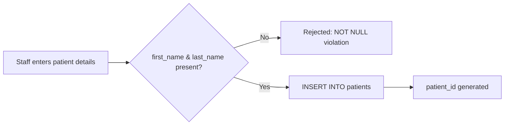
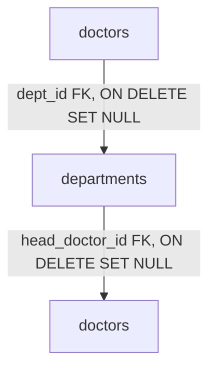
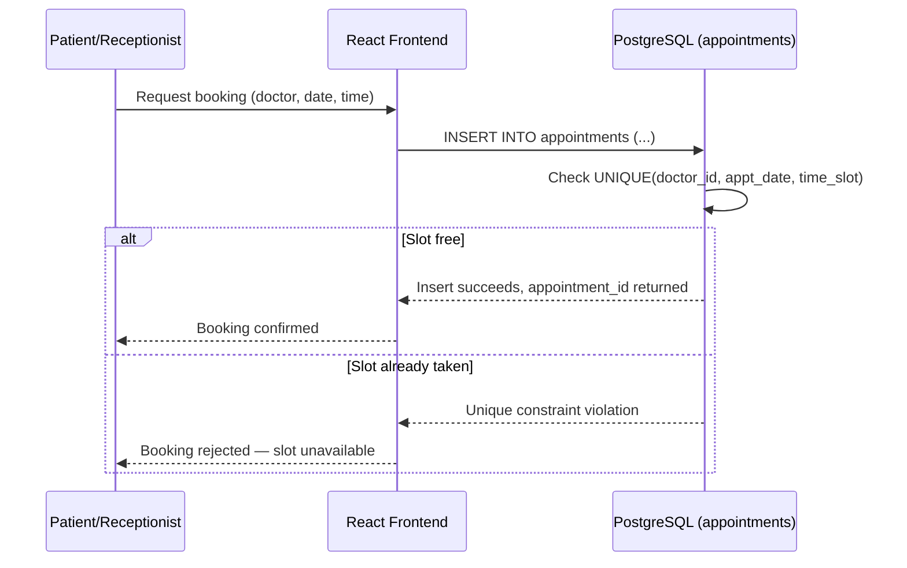
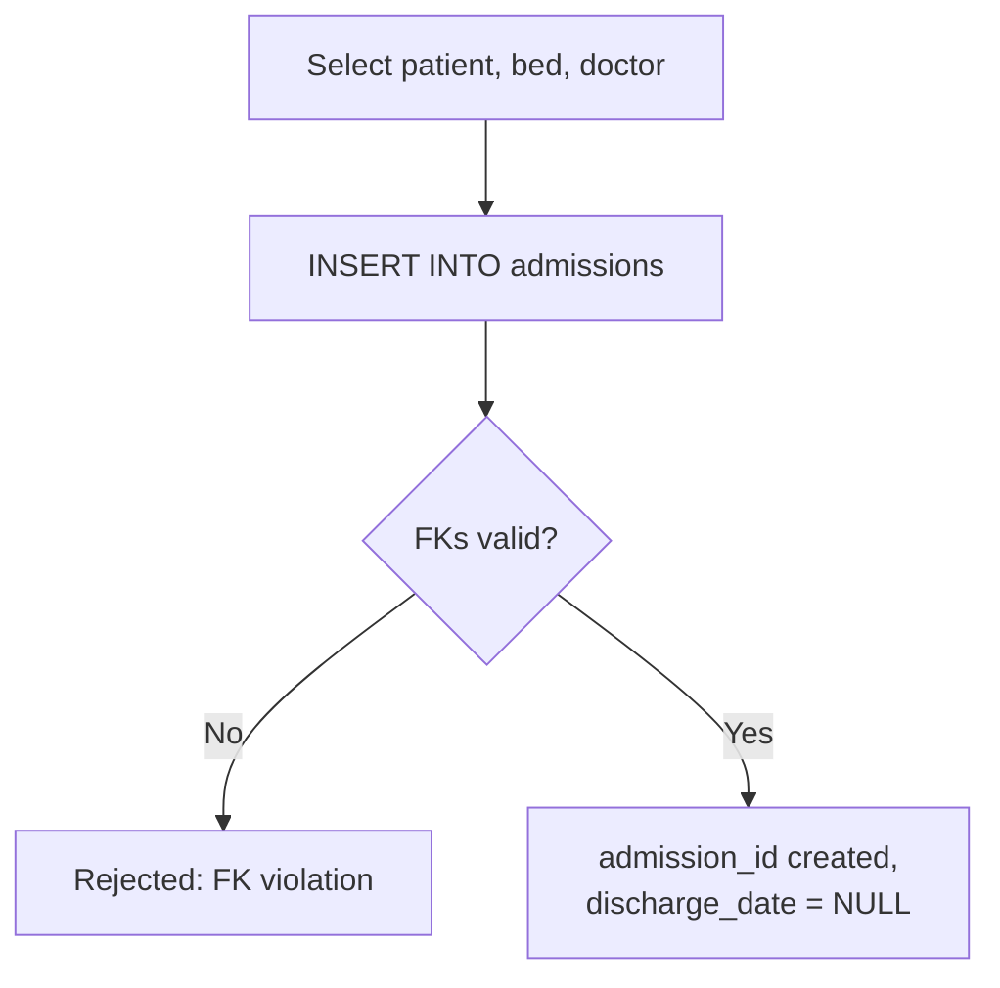
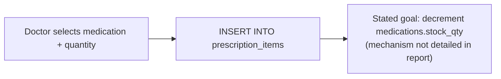
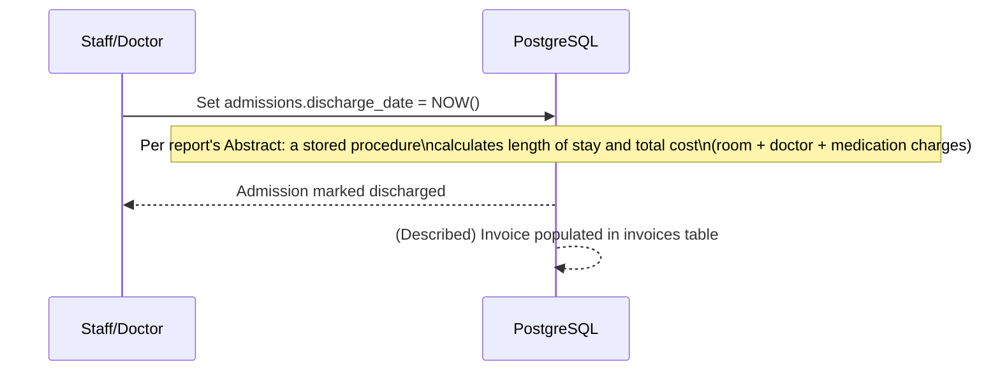
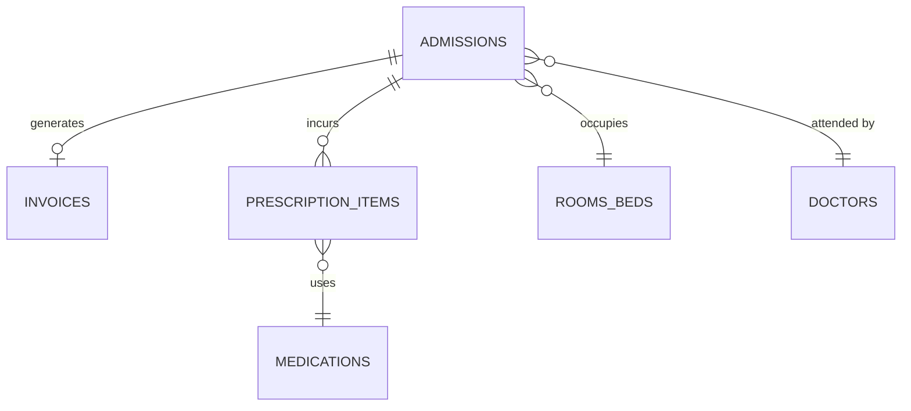

# Workflows — Hospital Management System

> Source of truth: the BCSE302P *Hospital Management System* project report (Anweshika Mehta, Drishti Priya). All table names, columns, constraints, and index names below are taken directly from the report's *Tables and Constraints* section and SQL excerpts. Where the report describes a business process only conceptually (in the Abstract or Project Scope) without showing the exact trigger/procedure code, this is stated explicitly rather than invented.

## Frontend Validation vs. Database Constraints vs. Database Business Logic

Before the workflows, it's worth being precise about three different layers that appear throughout this system, since the report's design leans heavily on the database layer:

- **Frontend validation** — checks performed in the React application before a request is even sent (e.g., "this field is required," "date must be in the future"). These improve user experience but are not authoritative: nothing stops a request from reaching the database without them. The report does not document any specific frontend validation logic; the React/TypeScript frontend is named only as part of the technology stack.
- **Database constraints** — rules enforced by PostgreSQL itself on every write, regardless of what sent it: `PRIMARY KEY`, `FOREIGN KEY`, `NOT NULL`, `UNIQUE`, and `CHECK` constraints. These are explicitly documented in the report (e.g., `fee > 0`, `stock_qty >= 0`, `UNIQUE (doctor_id, appt_date, time_slot)`). They are the last line of defense and cannot be bypassed by any client.
- **Database business logic** — triggers and stored procedures that encode multi-step rules beyond a single-column constraint (e.g., "when a patient is discharged, compute their bill"). The report's *Abstract* states that triggers and stored procedures were used for admission/discharge management and discharge billing calculations, but the report's SQL excerpts show only table/index definitions — the actual trigger and procedure bodies are **not included** in the document. Wherever this document below references such logic, it is described at the level of detail the report actually gives (i.e., that it exists and what it is supposed to do), without inventing specific function names, trigger syntax, or code that the report does not show.

---

## 1. Patient Registration

- **Actor:** Front-desk/administrative staff (via the React frontend)
- **Starting condition:** A new patient requires a record in the system (e.g., first visit)
- **Input:** `first_name`, `last_name`, `dob`, `gender`, `blood_group`, `contact`
- **Processing steps:**
  1. Staff enters patient demographic and contact details in the UI.
  2. Frontend performs basic validation (documented only as a general frontend responsibility, not detailed in the report).
  3. A new row is inserted into `patients`; `patient_id` is generated automatically (`SERIAL PRIMARY KEY`).
- **Database tables involved:** `patients`
- **Constraints involved:** `first_name`, `last_name` are `NOT NULL`; `patient_id` auto-generated; no `UNIQUE` constraint is documented on any patient field (e.g., duplicate names/contacts are not prevented at the database level per the report).
- **Trigger/procedure involvement:** None documented for this workflow.
- **Output:** A new `patient_id` usable for appointments and admissions.
- **Failure scenarios:** Missing `first_name`/`last_name` is rejected by the `NOT NULL` constraint; no other database-level rejection is documented (e.g., duplicate patients are not blocked).



## 2. Doctor Registration

- **Actor:** Administrative staff
- **Starting condition:** A doctor needs to be added to the system, optionally under a department
- **Input:** `dept_id` (optional), `first_name`, `last_name`, `specialization`, `fee`, `phone`
- **Processing steps:**
  1. Staff submits doctor details, optionally linking to an existing department.
  2. Row inserted into `doctors`.
- **Database tables involved:** `doctors`, `departments` (via foreign key)
- **Constraints involved:** `first_name`, `last_name` `NOT NULL`; `fee` must satisfy `CHECK (fee > 0)`; `dept_id` is a foreign key to `departments(dept_id)` with `ON DELETE SET NULL` — deleting a department does not delete its doctors, it only clears their `dept_id`.
- **Trigger/procedure involvement:** None documented.
- **Output:** New `doctor_id`.
- **Failure scenarios:** `fee <= 0` is rejected by the `CHECK` constraint; missing name fields rejected by `NOT NULL`.

## 3. Department Management

- **Actor:** Administrative staff
- **Starting condition:** A department needs to be created or have its head doctor assigned/changed
- **Input:** `dept_name`, `floor`, `head_doctor_id` (optional)
- **Processing steps:**
  1. Department created with `dept_name` and `floor`.
  2. `head_doctor_id` may reference an existing `doctors` row (added via a separate `ALTER TABLE ... ADD CONSTRAINT fk_head_doctor` in the report's SQL).
- **Database tables involved:** `departments`, `doctors`
- **Constraints involved:** `dept_name`, `floor` `NOT NULL`; `head_doctor_id` foreign key to `doctors(doctor_id)` with `ON DELETE SET NULL` — if the head doctor is deleted, the department record is preserved with `head_doctor_id` cleared, rather than the department being deleted.
- **Trigger/procedure involvement:** None documented.
- **Output:** New/updated `departments` row.
- **Failure scenarios:** Missing `dept_name`/`floor` rejected by `NOT NULL`.



## 4. Appointment Booking

- **Actor:** Patient or receptionist
- **Starting condition:** Patient wishes to book an outpatient visit with a specific doctor
- **Input:** `patient_id`, `doctor_id`, `appt_date`, `time_slot`
- **Processing steps:**
  1. Patient/receptionist selects doctor, date, and time slot.
  2. Row inserted into `appointments` with default `status = 'Scheduled'`.
- **Database tables involved:** `appointments`, `patients`, `doctors`
- **Constraints involved:** `patient_id`/`doctor_id` `NOT NULL` foreign keys, both `ON DELETE CASCADE` (deleting a patient or doctor removes their appointments); `status` restricted by `CHECK (status IN ('Scheduled','Completed','Cancelled'))`, default `'Scheduled'`; composite `UNIQUE (doctor_id, appt_date, time_slot)` — named `uq_doctor_slot` in the report.
- **Trigger/procedure involvement:** None documented; conflict prevention here is a **constraint**, not a trigger (see Workflow 5).
- **Output:** New `appointment_id` with status `Scheduled`.
- **Failure scenarios:** Booking the same doctor for the same date and time slot as an existing appointment is rejected by the `uq_doctor_slot` unique constraint (see Workflow 5).

## 5. Appointment Conflict Prevention

The report's *Project Scope* describes this as *"exclusive database-level conflict resolution to prevent double-booking for the same doctor-date-time."* Per the SQL shown, this is implemented specifically as the composite unique constraint:

```sql
CONSTRAINT uq_doctor_slot UNIQUE (doctor_id, appt_date, time_slot)
```

- **Actor:** System (PostgreSQL), triggered indirectly by a booking attempt
- **Starting condition:** A new appointment insert is attempted
- **Input:** `doctor_id`, `appt_date`, `time_slot` from the incoming appointment
- **Processing steps:**
  1. PostgreSQL checks the new `(doctor_id, appt_date, time_slot)` tuple against the unique index backing `uq_doctor_slot`.
  2. If a matching row already exists, the `INSERT` fails.
- **Database tables involved:** `appointments`
- **Constraints involved:** `uq_doctor_slot UNIQUE (doctor_id, appt_date, time_slot)`
- **Trigger/procedure involvement:** **None** — the report documents this specifically as a constraint-level mechanism, not a trigger. (Note: the report's Abstract separately states that *other* business processes, such as admissions/discharge, use triggers and stored procedures — but appointment conflict prevention itself is attributed to the unique constraint.)
- **Output:** Either a successfully booked appointment, or a rejected insert.
- **Failure scenarios:** Double-booking attempt raises a unique-constraint violation, which the application layer would need to catch and present to the user (exact frontend error-handling is not documented in the report).



## 6. Inpatient Admission

- **Actor:** Doctor or admissions staff
- **Starting condition:** A patient requires hospitalization and a bed is available
- **Input:** `patient_id`, `bed_id`, `doctor_id`, optional `notes`
- **Processing steps:**
  1. Staff selects an available bed and attending doctor for the patient.
  2. Row inserted into `admissions` with `admission_date` defaulting to `NOW()` and `discharge_date` left `NULL` (indicating an active stay).
- **Database tables involved:** `admissions`, `patients`, `rooms_beds`, `doctors`
- **Constraints involved:** `patient_id NOT NULL REFERENCES patients(patient_id) ON DELETE CASCADE`; `bed_id NOT NULL REFERENCES rooms_beds(bed_id)`; `doctor_id NOT NULL REFERENCES doctors(doctor_id)`; `admission_date TIMESTAMPTZ NOT NULL DEFAULT NOW()`; `discharge_date` nullable.
- **Trigger/procedure involvement:** The report's Abstract states that admission/discharge management was implemented "using database triggers and stored procedures" to avoid human error, but does not provide the specific trigger definitions in the SQL excerpts shown (e.g., no explicit trigger is shown that automatically flips `rooms_beds.status` to `'Occupied'` on admission). This document does not assert a specific trigger name or exact mechanism beyond what the report states in prose.
- **Output:** New `admission_id`, `discharge_date = NULL` (active admission).
- **Failure scenarios:** Referencing a nonexistent `patient_id`, `bed_id`, or `doctor_id` is rejected by the respective foreign key constraints.



## 7. Bed Allocation

- **Actor:** Admissions staff
- **Starting condition:** A ward/bed must be identified as available before admission
- **Input:** Desired `ward_type` (`'ICU'`, `'General'`, or `'Private'`)
- **Processing steps:**
  1. Staff/system queries `rooms_beds` for rows with `status = 'Vacant'` in the desired `ward_type`.
  2. A partial index, `idx_admissions_active ON admissions(bed_id) WHERE discharge_date IS NULL`, supports efficiently finding beds currently tied to an active (non-discharged) admission.
  3. Selected bed is used in the Inpatient Admission workflow (Workflow 6).
- **Database tables involved:** `rooms_beds`, `admissions`
- **Constraints involved:** `ward_type CHECK (ward_type IN ('ICU','General','Private'))`; `status CHECK (status IN ('Vacant','Occupied','Sanitizing')) DEFAULT 'Vacant'`; `daily_rate CHECK (daily_rate > 0)`.
- **Trigger/procedure involvement:** The report's Abstract references a decision-support **view** that "contains day rates and physician lists for wards," described as partially indexed using B-trees — this supports querying bed/rate information but is not itself part of the allocation write path. The report does not document a trigger that automatically updates `rooms_beds.status` on admission or discharge.
- **Output:** A specific `bed_id` reserved for a new admission.
- **Failure scenarios:** No bed of the requested `ward_type` with `status = 'Vacant'` is found — handled at the query level, not by a database constraint.

## 8. Medication Management

- **Actor:** Pharmacy staff
- **Starting condition:** Medication catalog needs to be created or restocked
- **Input:** `med_name`, `unit_price`, `stock_qty`, `min_threshold` (optional, defaults to 15)
- **Processing steps:**
  1. Staff adds a new medication or updates `stock_qty` for an existing one.
  2. Row inserted/updated in `medications`.
- **Database tables involved:** `medications`
- **Constraints involved:** `unit_price CHECK (unit_price > 0)`; `stock_qty CHECK (stock_qty >= 0)`; `min_threshold INT NOT NULL DEFAULT 15`.
- **Trigger/procedure involvement:** The *Project Scope* section lists "minimum stock threshold management" as an in-scope feature. The report does not show the specific trigger/procedure code that compares `stock_qty` to `min_threshold` and raises an alert — only that this is a stated goal of the pharmacy module.
- **Output:** Updated medication stock levels.
- **Failure scenarios:** Negative stock or non-positive unit price rejected by `CHECK` constraints.

## 9. Prescription Processing

- **Actor:** Doctor (during an inpatient admission)
- **Starting condition:** An active admission exists and a medication needs to be prescribed
- **Input:** `admission_id`, `med_id`, `quantity`, `dosage_instructions`
- **Processing steps:**
  1. Doctor selects a medication and quantity for a specific admission.
  2. Row inserted into `prescription_items`.
- **Database tables involved:** `prescription_items`, `admissions`, `medications`
- **Constraints involved:** `admission_id NOT NULL REFERENCES admissions(admission_id) ON DELETE CASCADE`; `med_id NOT NULL REFERENCES medications(med_id)`; `quantity CHECK (quantity > 0)`.
- **Trigger/procedure involvement:** The *Project Scope* states "inventory decrement upon prescription issuance" as an in-scope feature — i.e., prescribing a medication is meant to reduce `medications.stock_qty`. The report does not include the SQL for the trigger/procedure that performs this decrement, so the exact mechanism (row-level trigger vs. application-level update) is not specified in the source document.
- **Output:** New `prescription_items` row, and (per the stated scope) a corresponding reduction in `medications.stock_qty`.
- **Failure scenarios:** `quantity <= 0` rejected by `CHECK`; referencing a nonexistent `admission_id`/`med_id` rejected by foreign keys.



## 10. Inventory Update

- **Actor:** System (in principle, per stated scope) / pharmacy staff
- **Starting condition:** A prescription has been issued, or manual restocking occurs
- **Input:** `med_id`, quantity change
- **Processing steps:**
  1. On prescription issuance, `medications.stock_qty` is meant to decrease by the prescribed quantity (per *Project Scope*).
  2. On restocking, staff increases `stock_qty` directly.
- **Database tables involved:** `medications`, `prescription_items`
- **Constraints involved:** `stock_qty CHECK (stock_qty >= 0)` — prevents stock from going negative regardless of how the update is performed.
- **Trigger/procedure involvement:** As in Workflow 9, the report states the decrement behavior as a design goal in the *Project Scope* but does not provide the specific trigger/procedure code implementing it.
- **Output:** Updated `stock_qty`.
- **Failure scenarios:** An update that would drive `stock_qty` below zero is rejected by the `CHECK (stock_qty >= 0)` constraint.

## 11. Patient Discharge

- **Actor:** Doctor or admissions staff
- **Starting condition:** An active admission (`discharge_date IS NULL`) exists
- **Input:** `admission_id`, discharge confirmation
- **Processing steps:**
  1. Staff marks the admission as discharged; `admissions.discharge_date` is set (previously `NULL`).
  2. Per the report's Abstract, a stored procedure is described as calculating the length of stay and total billing cost at this point, incorporating room type, doctor's fee, and medication usage.
- **Database tables involved:** `admissions`, `rooms_beds` (for `daily_rate`/`ward_type`), `doctors` (for `fee`), `prescription_items`/`medications` (for medication charges), `invoices` (destination for the calculated bill — see Workflow 12–13)
- **Constraints involved:** None beyond the existing foreign keys on `admissions`; `discharge_date` has no `CHECK` constraint documented, only its nullability.
- **Trigger/procedure involvement:** The Abstract explicitly describes: *"a special procedure was created that, upon a patient's discharge, calculates the length of stay and billing costs, including room types, doctor's fees, and medication usage."* The Abstract also states that admissions/discharges "cannot involve any human errors" and were "implemented using database triggers and stored procedures," and separately notes that units are discharged automatically if balances are not settled. The report does not provide the SQL definitions for these triggers/procedures, so their exact logic, naming, and firing conditions are not specified beyond this prose description; this document does not invent that missing detail.
- **Output:** `admissions.discharge_date` set; (per the described procedure) a computed length of stay and bill, feeding into `invoices`.
- **Failure scenarios:** Not detailed in the report beyond the general statement that discharge and balance settlement are linked; the precise failure/rejection conditions are not specified.



## 12. Billing

- **Actor:** System (via the discharge-time procedure described in the Abstract) / billing staff
- **Starting condition:** A patient has been discharged (Workflow 11)
- **Input:** `admission_id`, associated room charges, doctor charges, medication charges
- **Processing steps:**
  1. Charges are aggregated from the bed's `daily_rate` × length of stay, the attending doctor's `fee`, and the sum of prescribed medication costs (`prescription_items.quantity × medications.unit_price`) — this aggregation is described conceptually in the *Project Scope* ("consolidated invoices... with aggregated bed, attending doctor, and medication costs") and the Abstract, but the exact calculation formula/SQL is not shown.
  2. A row is written/updated in `invoices` with `room_charge`, `doctor_charge`, `pharmacy_charge`, and `total_amount`.
- **Database tables involved:** `invoices`, `admissions`, `rooms_beds`, `doctors`, `prescription_items`, `medications`
- **Constraints involved:** `admission_id NOT NULL REFERENCES admissions(admission_id) ON DELETE CASCADE`; `room_charge`, `doctor_charge`, `pharmacy_charge`, `total_amount` all `NUMERIC(10,2) NOT NULL DEFAULT 0`; `status CHECK (status IN ('Pending','Paid')) DEFAULT 'Pending'`; `created_at TIMESTAMPTZ NOT NULL DEFAULT NOW()`.
- **Trigger/procedure involvement:** Same discharge-time stored procedure referenced in Workflow 11 and the Abstract; no separate billing-specific trigger code is shown in the report.
- **Output:** An `invoices` row with `status = 'Pending'` and a computed `total_amount`.
- **Failure scenarios:** An invoice referencing a nonexistent `admission_id` is rejected by the foreign key; no other billing-specific validation is documented.

## 13. Invoice Generation

- **Actor:** System, at the point of discharge
- **Starting condition:** Discharge and billing calculation (Workflows 11–12) have occurred
- **Input:** Computed `room_charge`, `doctor_charge`, `pharmacy_charge`
- **Processing steps:**
  1. `total_amount` is derived from the sum of the three charge components (as described conceptually in the report; exact formula/trigger not shown).
  2. `invoices` row created with `status` defaulting to `'Pending'`.
  3. Payment settlement (not detailed in the report) would later update `status` to `'Paid'`.
- **Database tables involved:** `invoices`
- **Constraints involved:** `status CHECK (status IN ('Pending','Paid'))`; all monetary fields `NUMERIC(10,2) NOT NULL DEFAULT 0`.
- **Trigger/procedure involvement:** Per the Abstract, invoice population is part of the same discharge-time stored procedure; the report additionally states that admissions are discharged automatically "if they fail to settle their balances" — this statement appears in the Abstract but its precise trigger condition and timing are not detailed further in the report, so it is reported here as stated rather than expanded upon.
- **Output:** A finalized `invoices` record tied to the `admission_id`, indexed via `idx_invoices_admission ON invoices(admission_id)` for lookup.
- **Failure scenarios:** Not further specified in the report beyond the constraints listed above.



---

*All workflow details above are drawn directly from the report's ER diagram, table/constraint listing, SQL excerpts, Abstract, and Project Scope sections. Where the report describes a business rule only in prose (without accompanying SQL for a trigger or procedure), this document states that explicitly rather than fabricating the missing implementation.*
